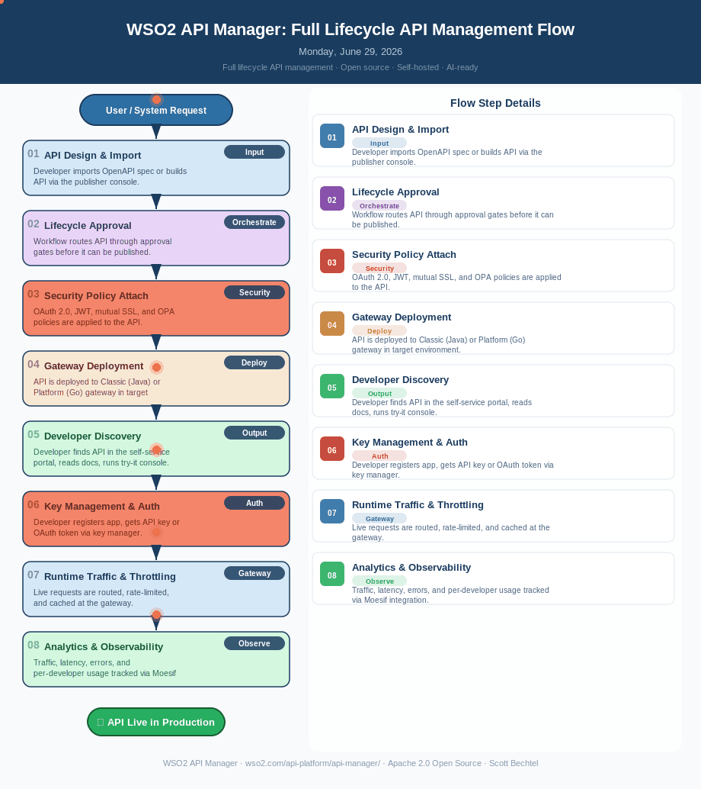

# WSO2 API Manager: Full Lifecycle API Management Flow

**Date:** Monday, June 29, 2026
**Product:** [WSO2 API Manager](https://wso2.com/api-platform/api-manager/)
**License:** Apache 2.0 Open Source
**Author:** Scott Bechtel

---

---

## Business Problem

Enterprise teams managing hundreds of APIs across multiple clouds, on-premises clusters, and partner environments struggle to enforce consistent governance, security, and lifecycle policies. Without a unified platform, teams cobble together separate tools for design, security, publishing, and monitoring — creating gaps in coverage, inconsistent policy enforcement, and significant engineering overhead just to keep integrations running. The result is slower time-to-market, compliance risk, and frustrated developers who spend more time navigating tooling than building.

---

## How WSO2 API Manager Solves This

WSO2 API Manager is an all-in-one, open-source API management platform that handles the full lifecycle from design to retirement in a single self-hosted server. It unifies the publisher console, developer portal, gateway, key manager, and analytics so teams eliminate the integration plumbing between disparate tools. Built for regulated industries — government, finance, healthcare — it runs air-gapped, on-premises, or on Kubernetes with full audit logging and zero vendor lock-in. And with built-in LLM routing, guardrails, semantic caching, and MCP Hub support, it's already AI-ready for the next wave of agent-driven integrations.

---

## Patterns Used

| Pattern | Description |
|---|---|
| **API Gateway Pattern** | Centralized traffic routing, rate limiting, and policy enforcement at the gateway layer |
| **API Lifecycle Management** | Structured states from creation through deprecation with approval workflows |
| **OAuth 2.0 / OIDC** | Standards-based authentication and authorization for APIs and developer applications |
| **Policy-as-Code (OPA/XACML)** | Declarative, auditable authorization policies enforced at runtime across all gateways |

---

## Flow Steps

| # | Step | Category | Description |
|---|---|---|---|
| 01 | API Design & Import | Input | Developer imports OpenAPI spec or builds API via the publisher console |
| 02 | Lifecycle Approval | Orchestrate | Workflow routes API through approval gates before it can be published |
| 03 | Security Policy Attach | Security | OAuth 2.0, JWT, mutual SSL, and OPA policies are applied to the API |
| 04 | Gateway Deployment | Deploy | API is deployed to Classic (Java) or Platform (Go) gateway in target environment |
| 05 | Developer Discovery | Output | Developer finds API in the self-service portal, reads docs, runs try-it console |
| 06 | Key Management & Auth | Auth | Developer registers app, gets API key or OAuth token via key manager |
| 07 | Runtime Traffic & Throttling | Gateway | Live requests are routed, rate-limited, and cached at the gateway |
| 08 | Analytics & Observability | Observe | Traffic, latency, errors, and per-developer usage tracked via Moesif integration |

---

## Learn More
[WSO2 API Manager](https://wso2.com/api-platform/api-manager/)
