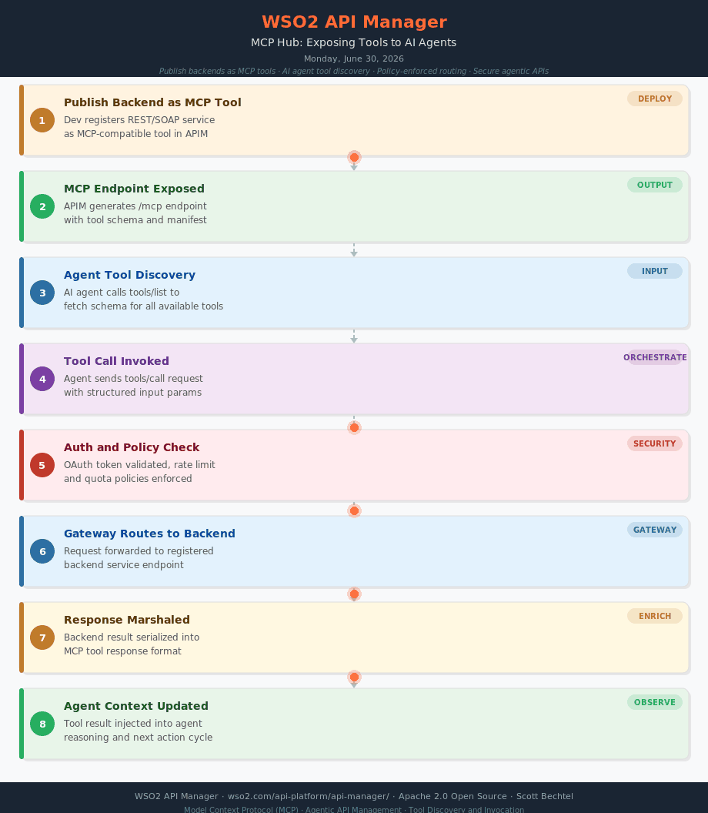

# API Manager: MCP Hub — Exposing Tools to AI Agents
**Date:** Monday, June 30, 2026  **Product:** [WSO2 API Manager](https://wso2.com/api-platform/api-manager/)

## Flow Overview
How WSO2 API Manager acts as an MCP Hub — publishing backend services as Model Context Protocol tools that AI agents can discover and invoke with full policy enforcement.
