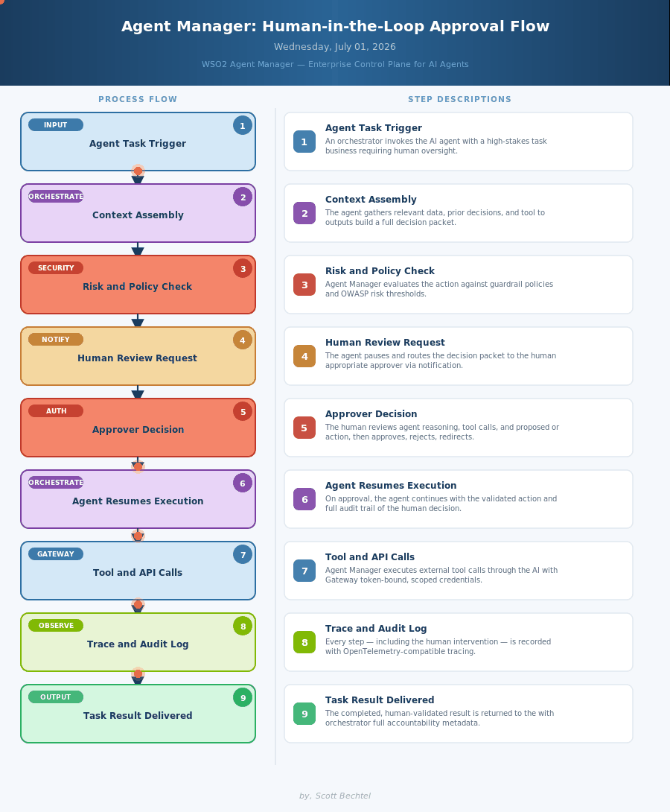

# WARNING
I am unable to find documenation for AMP that supports this flow. I'm following up to see if this is possible.

# Agent Manager: Human-in-the-Loop Approval Flow
**Date:** 2026-07-01  **Product:** [WSO2 Agent Manager](https://wso2.com/agent-platform/agent-manager/)

## Business Problem
Enterprises deploying AI agents for high-stakes tasks have no reliable mechanism to inject human oversight at the right moment. Agents either run fully autonomously (too risky) or require constant babysitting (too slow), leaving a dangerous gap between innovation and governance.

## How WSO2 Agent Manager Solves This
WSO2 Agent Manager's Human-in-the-Loop capability lets agents pause mid-execution and route decision packets to the right approver with full context, reasoning traces, and proposed actions before proceeding. Policy-based risk evaluation determines when human review is required. Every human intervention is recorded with OpenTelemetry tracing for a complete audit trail.

## Patterns Used
- Human-in-the-Loop (HITL) Orchestration
- Policy-Based Risk Gating
- Zero-Trust Agent Runtime
- OpenTelemetry Distributed Tracing

WSO2 Agent Manager · wso2.com/agent-platform/agent-manager/ · Apache 2.0 Open Source · Auto Generated By AI
