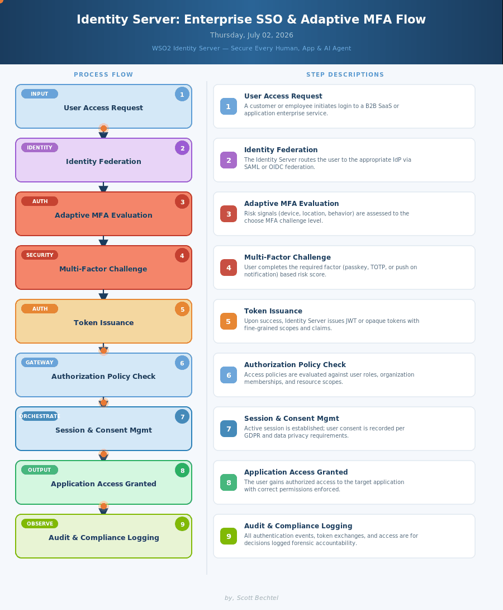

# Identity Server: Enterprise SSO and Adaptive MFA Flow
**Date:** 2026-07-02  **Product:** [WSO2 Identity Server](https://wso2.com/identity-platform/identity-server/)

## Business Problem
Enterprise organizations struggle to manage identity across siloed systems — separate passwords, MFA policies, and access controls for thousands of employees, customers, and AI agents with no unified governance layer.

## How WSO2 Identity Server Solves This
WSO2 Identity Server unifies every identity type under one governance layer built on OIDC, OAuth 2.0, and SAML. Adaptive MFA evaluates real-time risk signals so high-risk logins trigger step-up challenges while trusted sessions stay frictionless. Fine-grained authorization and GDPR-ready consent management make compliance a by-product of the architecture.

## Patterns Used
- OAuth 2.0 / OIDC
- Zero Trust Security
- Federated Identity
- Risk-Based Adaptive Authentication

WSO2 Identity Server · wso2.com/identity-platform/identity-server/ · Apache 2.0 Open Source · Scott Bechtel
