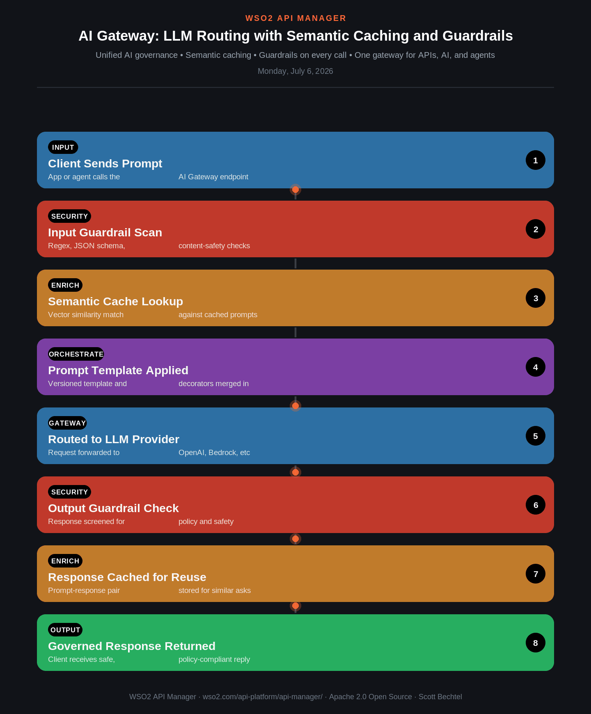

# API Manager: AI Gateway: LLM Routing with Semantic Caching and Guardrails
**Date:** Monday, July 6, 2026  **Product:** [API Manager](https://wso2.com/api-platform/api-manager/)

## Business Problem
Enterprises bolt LLM calls directly into apps and agents with no central control point: no visibility into token spend, no consistent safety policy across providers, and identical-ish prompts burning tokens on every single call.

## How WSO2 Solves This
The AI Gateway sits in front of every LLM and AI API call. It matches incoming prompts against a semantic cache using vector similarity (not just exact text match) to skip redundant model calls, applies input/output guardrails — regex, JSON schema, content-safety checks, or provider-native filters like Azure Content Safety and AWS Bedrock Guardrails — before and after the model call, and centrally versions prompt templates so every team calls models the same governed way.

## Patterns Used
- Semantic Caching
- Guardrail Pipeline (pre/post)
- Prompt Template Versioning
- Provider-Native Safety Integration
- Centralized AI Governance
