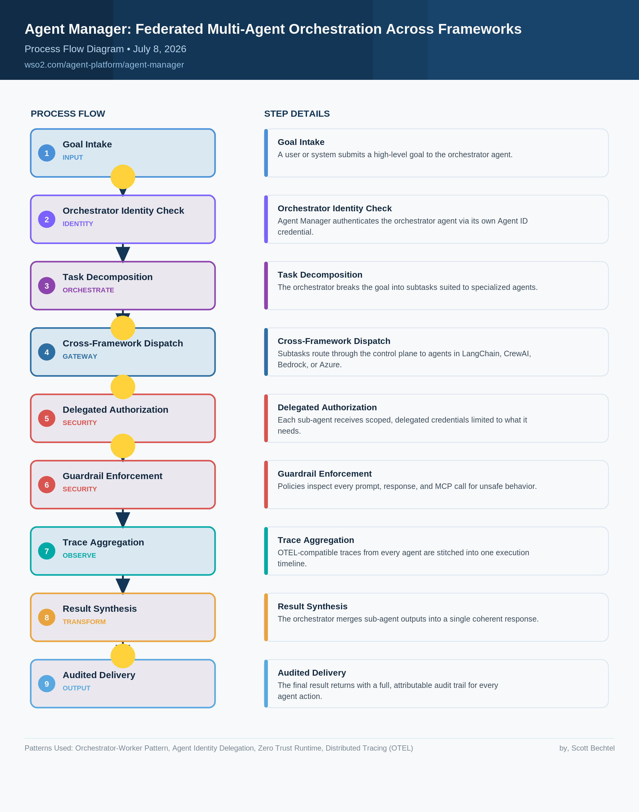

# Agent Manager: Federated Multi-Agent Orchestration Across Frameworks
**Date:** 2026-07-08  **Product:** [Agent Manager](https://wso2.com/agent-platform/agent-manager/)

## Business Problem**

Enterprise teams build agents in different frameworks such as LangChain, CrewAI, Bedrock, and Azure AI, then deploy them across clouds and on-prem runtimes. When a multi-agent workflow spans these boundaries, there is no shared identity, governance, or trace to show what any agent actually did, leaving fragmented oversight and unattributed actions.

## How WSO2 Solves This

WSO2 Agent Manager gives every agent, regardless of framework or runtime, a home in one control plane, so an orchestrator agent can decompose a goal and dispatch subtasks to specialized agents running in LangChain, CrewAI, Bedrock, or WSO2's own zero-trust runtime. 

### Agent Running In Agent Manager ###
Each agent gets a first-class identity through Agent ID, with delegated, scoped credentials and instant revocation, so every action stays attributable. Built-in guardrails inspect every LLM, tool, and MCP interaction along the way, while OTEL-based tracing stitches sub-agent activity into one coherent execution trace.

## Architecture

NOTE: Steps 3) Orchestrate and 8) Transform are up to the provided Agent to do.

## Patterns Used

- Orchestrator-Worker Pattern
- Agent Identity Delegation
- Zero Trust Runtime
- Distributed Tracing (OTEL)
