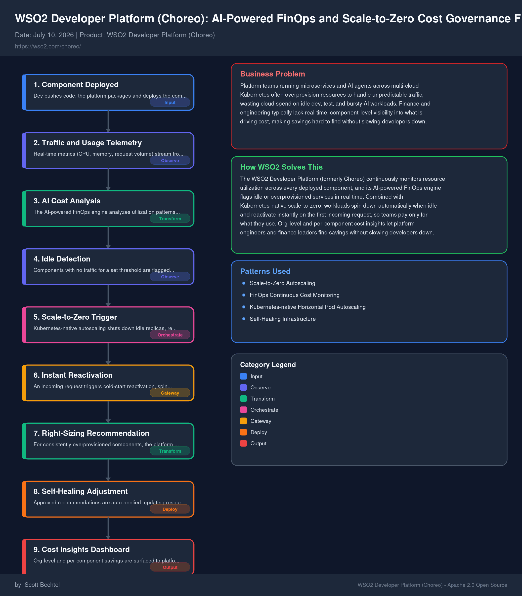

# Choreo: AI-Powered FinOps and Scale-to-Zero Cost Governance Flow
**Date:** 2026-07-10  **Product:** [WSO2 Developer Platform (Choreo)](https://wso2.com/choreo/)

## Business Problem

Platform teams running microservices and AI agents across multi-cloud Kubernetes often overprovision resources to handle unpredictable traffic, wasting cloud spend on idle dev, test, and bursty AI workloads. Finance and engineering typically lack real-time, component-level visibility into what is driving cost, making savings hard to find without slowing developers down.

## How WSO2 Solves This

The WSO2 Developer Platform (formerly Choreo) continuously monitors resource utilization across every deployed component, and its AI-powered FinOps engine flags idle or overprovisioned services in real time. Combined with Kubernetes-native scale-to-zero, workloads spin down automatically when idle and reactivate instantly on the first incoming request, so teams pay only for what they use. Org-level and per-component cost insights let platform engineers and finance leaders find savings without slowing developers down.

## Architecture

## Patterns Used

- Scale-to-Zero Autoscaling
- FinOps Continuous Cost Monitoring
- Kubernetes-native Horizontal Pod Autoscaling
- Self-Healing Infrastructure
