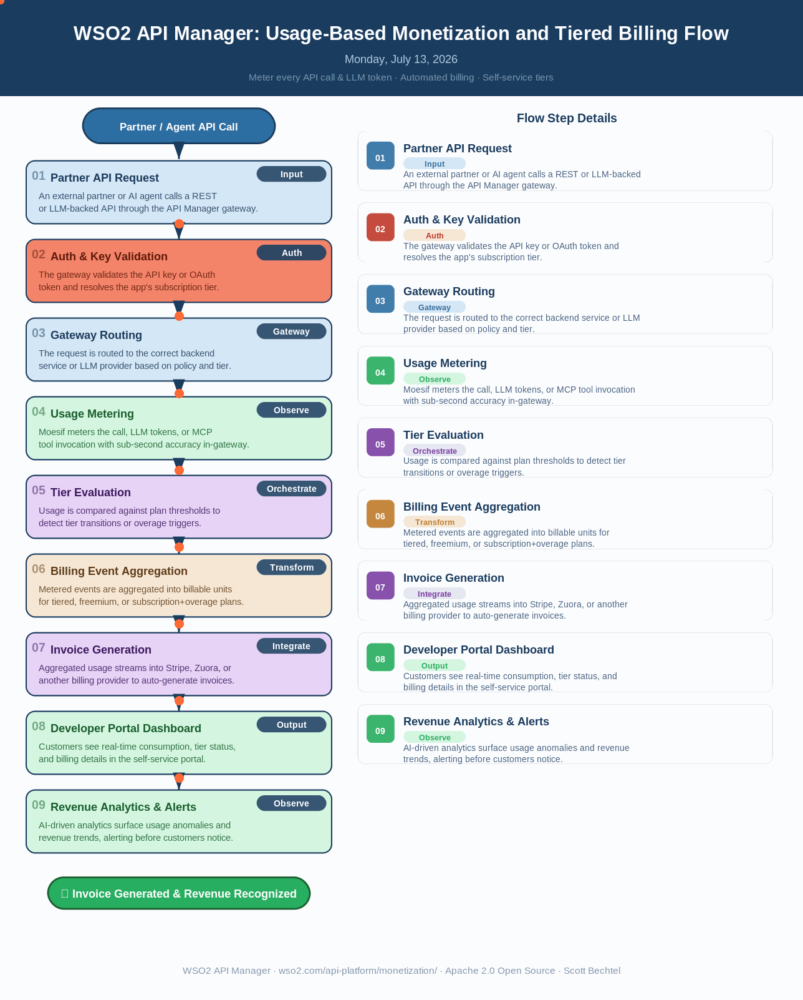

# API Manager: Usage-Based Monetization and Tiered Billing Flow
**Date:** 2026-07-13  **Product:** [API Manager](https://wso2.com/api-platform/monetization/)

## Business Problem
A SaaS company exposes REST and LLM-backed APIs to hundreds of external partners, but billing is stuck in spreadsheets and manual invoices reconciled weeks after usage occurs. Finance can't tell which customers are approaching contract limits until a dispute arrives, and product teams have no way to trial a new tiered-pricing model without shipping custom metering code into every microservice.

## How WSO2 Solves This
*WSO2 API Manager Server*, paired with its *Moesif-powered* Monetization capability, meters every API call, LLM token, and MCP tool invocation directly in the gateway with sub-second accuracy, so no custom instrumentation is needed in application code. 

Pricing teams define: 
- pay-as-you-go
- prepaid credit
- tiered
- freemium
- or subscription+overage models directly in Moesif

Customers transition tiers automatically as usage crosses thresholds. Usage data streams straight into Stripe, Zuora, or any billing provider, so invoices generate themselves and revenue recognition happens in near real time. Because metering runs in the gateway itself, it works the same way whether the API lives on WSO2, AWS, Kong, or another supported gateway, giving finance a single source of truth across every deployment.

## Architecture

## Patterns Used
- Usage-Based Pricing Pattern
- Tiered Rate Limiting Pattern
- Event-Driven Billing Aggregation
- Federated Gateway Metering

