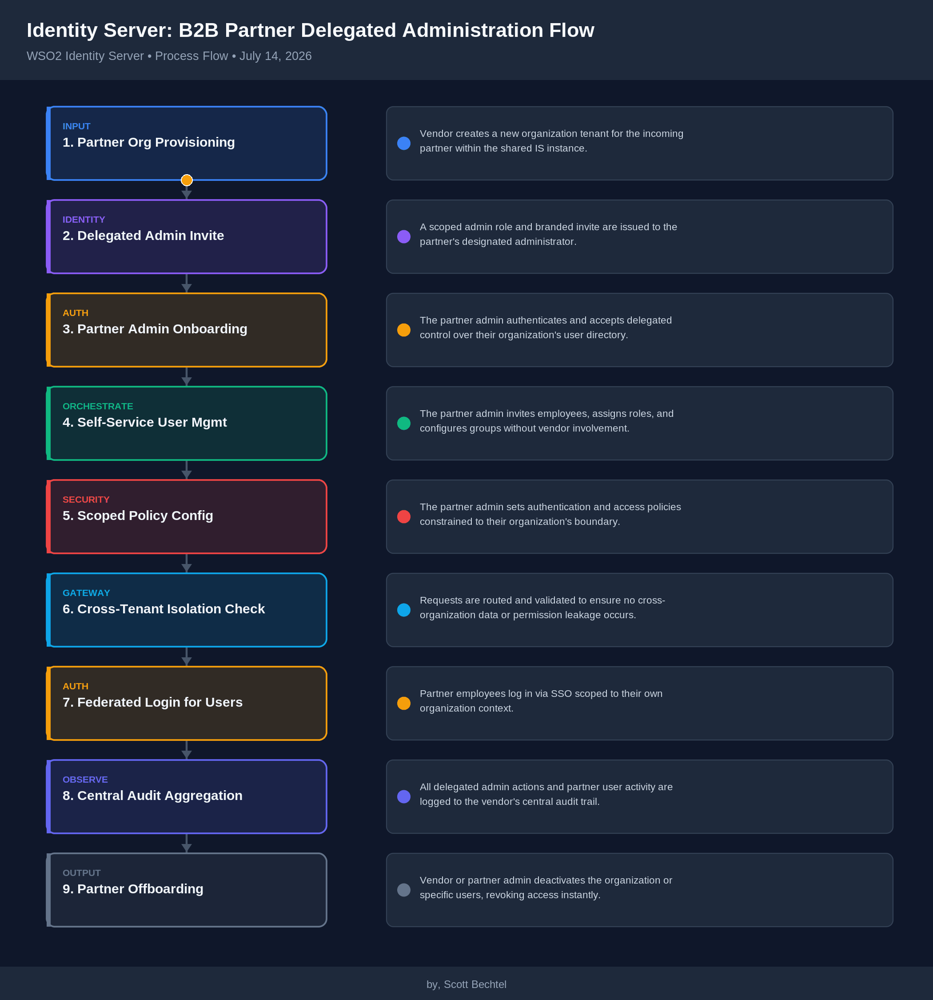

# Identity Server: B2B Partner Delegated Administration Flow
**Date:** Tuesday, July 14, 2026  **Product:** [Identity Server](https://wso2.com/identity-and-access-management/)

## Business Problem
When a new B2B partner comes on board, their staff need to manage their own users, roles, and app access — without WSO2's customer's central IT team hand-creating every account, and without handing partner admins the keys to the entire tenant. Manual sub-org provisioning turns partner onboarding into a multi-day support queue, and over-broad admin grants become a growing security liability as the partner count climbs into the hundreds.

## How WSO2 Solves This
WSO2 Identity Server's B2B organization management spins up each partner as an isolated sub-organization — its own user store, branding, and app access — provisioned through a single API call instead of a ticket. Scoped administrator roles let a partner's own staff manage their users, groups, and app assignments without ever touching another tenant's data or the parent org's configuration. Because the whole flow is API-first, the same delegated-admin process a support engineer might do by hand can be automated into a self-service partner portal, cutting onboarding from days to minutes while keeping a full audit trail per sub-org.

## Patterns Used
- Multi-Tenant Sub-Organization Isolation
- Scoped RBAC / Delegated Admin Roles
- API-First Tenant Provisioning
- Per-Sub-Org Audit Trail

## Architecture

WSO2 Identity Server · wso2.com/identity-and-access-management/ · Auto Generated By AI
