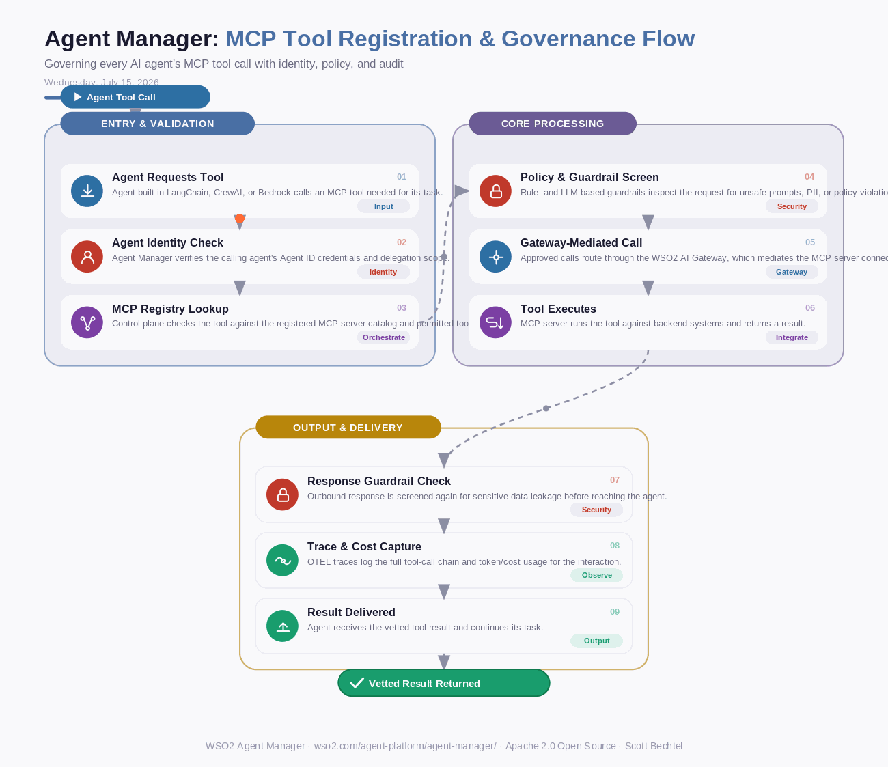

# Agent Manager: MCP Tool Registration & Governance Flow
**Date:** Wednesday, July 15, 2026  **Product:** [Agent Manager](https://wso2.com/agent-platform/agent-manager/)

## Business Problem

Enterprises deploying AI agents across LangChain, CrewAI, and Bedrock increasingly connect them to MCP servers exposing internal tools and data sources, but without centralized registration, any agent can invoke any MCP tool with no policy checks. This creates an ungoverned attack surface where a hijacked or misconfigured agent could exfiltrate data or trigger destructive actions via an MCP tool it should never have reached.

## How WSO2 Solves This

WSO2 Agent Manager gives every MCP server and tool a registered identity in a single control plane, so security teams can see exactly which agents can call which tools before an agent ever executes. Built-in policy and guardrail enforcement — backed by the WSO2 AI Gateway — screens each MCP request and response for unsafe prompts, PII, or policy violations, while OTEL-based tracing captures the full tool-call chain for audit. Because agents get their own first-class identity via Agent ID, MCP access can be scoped, delegated, and revoked instantly instead of relying on shared credentials. Teams keep the freedom to mix agent frameworks while IT keeps a single, enforceable governance layer over every MCP interaction.

## Patterns Used

- Zero Trust Security
- Policy-as-Code Guardrails
- Tool Registry Pattern
- Delegated Identity & Revocation

## Architecture

---
WSO2 Agent Manager · wso2.com/agent-platform/agent-manager/ · Auto Generated By AI
