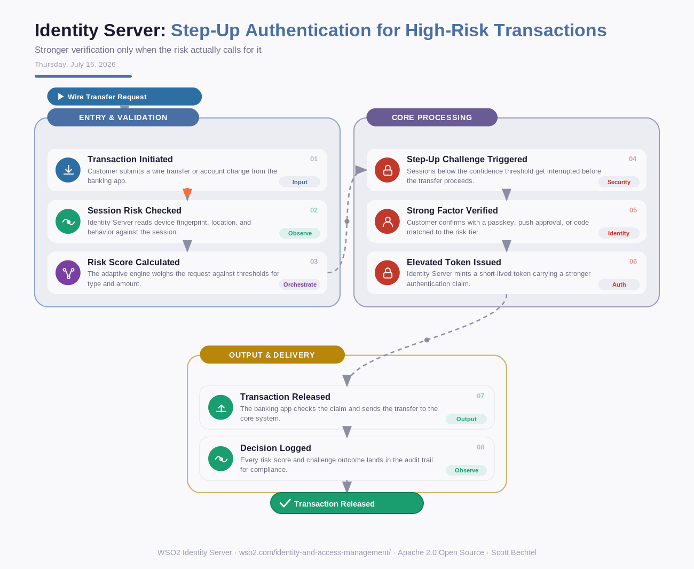

# Identity Server: Step-Up Authentication for High-Risk Transactions
**Date:** Thursday, July 16, 2026  **Product:** [Identity Server](https://wso2.com/identity-and-access-management/)

## Business Problem

A bank lets customers approve a $50,000 wire transfer with the same PIN they use to check a balance. An attacker who has phished that PIN walks straight through - no extra friction, no second check. Regulators expect stronger proof for high-risk moves, and customers still want to tap a 4-digit code for everything else.

## How WSO2 Solves This

WSO2 Identity Server scores each request in real time, weighing device, location, and transaction type, then steps up authentication only when the risk actually calls for it. Routine logins stay one tap. A large transfer or a changed beneficiary triggers a passkey or push challenge before it clears. Banks get FIDO2-grade assurance exactly where fraud lives, without taxing every login with friction nobody asked for.

## Patterns Used

- Risk-Based Adaptive Authentication
- Step-Up Authentication (ACR Elevation)
- Zero Trust Continuous Verification
- FIDO2/WebAuthn Strong Factor

## Architecture

---
WSO2 Identity Server · wso2.com/identity-and-access-management/ ·  by, Scott Bechtel
