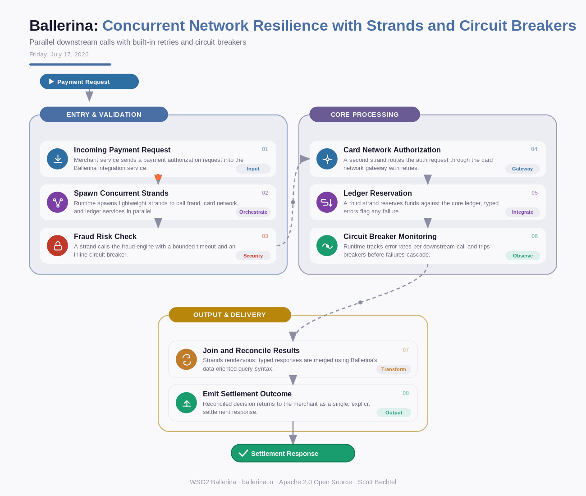

# Ballerina: Concurrent Network Resilience with Strands and Circuit Breakers
**Date:** Friday, July 17, 2026  **Product:** [Ballerina](https://ballerina.io/)

## Business Problem
A payments team orchestrating calls to three downstream partners — the card network, a fraud-scoring engine, and the core ledger — sees cascading timeouts whenever one partner slows down under load, because their existing thread-and-callback code swallows errors silently. Engineers re-implement retries, timeouts, and circuit breakers by hand for every new integration, and race conditions in shared thread pools cause production incidents that are hard to reproduce.

## How WSO2 Solves This
Ballerina treats network calls as first-class language constructs, so concurrency, timeouts, retries, and circuit breakers are built into the language instead of bolted on with libraries. Lightweight strands run each downstream call independently and safely, without manual thread pool management, and explicit error types make failure paths visible in the code rather than hidden in callback chains. Because a Ballerina program's control flow doubles as a sequence diagram, the team can review exactly how the three partner calls fan out and reconverge — resilience behavior becomes something you can look at, not just read. The payoff: fewer surprise cascading failures under load, and days instead of weeks to add the next resilient downstream integration.

## Patterns Used
- Strand-Based Concurrency Model
- Circuit Breaker Pattern
- Retry with Exponential Backoff
- Sequence-Diagram-Driven Orchestration

## Architecture

---
WSO2 Ballerina · ballerina.io · by, Scott Bechtel
