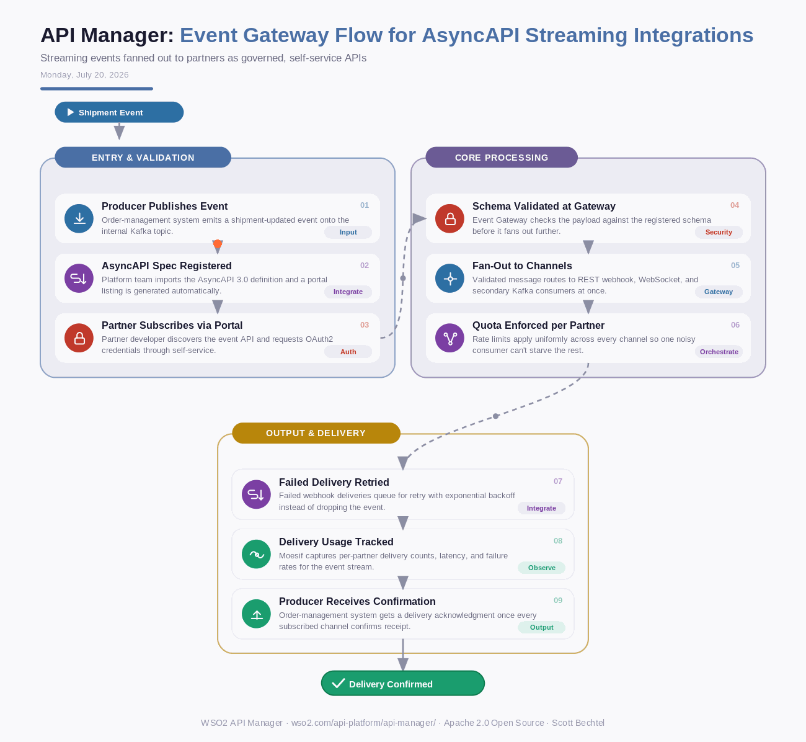

# API Manager: Event Gateway Flow for AsyncAPI Streaming Integrations
**Date:** Monday, July 20, 2026  **Product:** [API Manager](https://wso2.com/api-platform/api-manager/)

## Business Problem

A logistics company publishes real-time shipment tracking events, but partners consume them through different protocols - some want webhooks, some want Kafka, some want a WebSocket feed. Without a shared event gateway, each new partner integration means custom glue code, and one schema change breaks several consumer pipelines at once.

## How WSO2 Solves This

WSO2 API Manager Server treats event streams as first-class APIs. Import an AsyncAPI spec the same way you'd import an OpenAPI definition, and the platform generates a portal listing, subscription flow, and governed access for the event topic. The Event Gateway fans a single Kafka or MQTT stream out to REST webhooks, WebSocket clients, and other brokers, applying the same throttling, auth, and audit policies used across REST APIs. Partners subscribe through the self-service developer portal instead of waiting on custom integration work from your team.

## Patterns Used

- Event Fan-Out Pattern
- AsyncAPI Schema Governance
- Exponential Backoff Retry
- Multi-Protocol Bridging

## Architecture

---
WSO2 API Manager · wso2.com/api-platform/api-manager/ · by, Scott Bechtel
