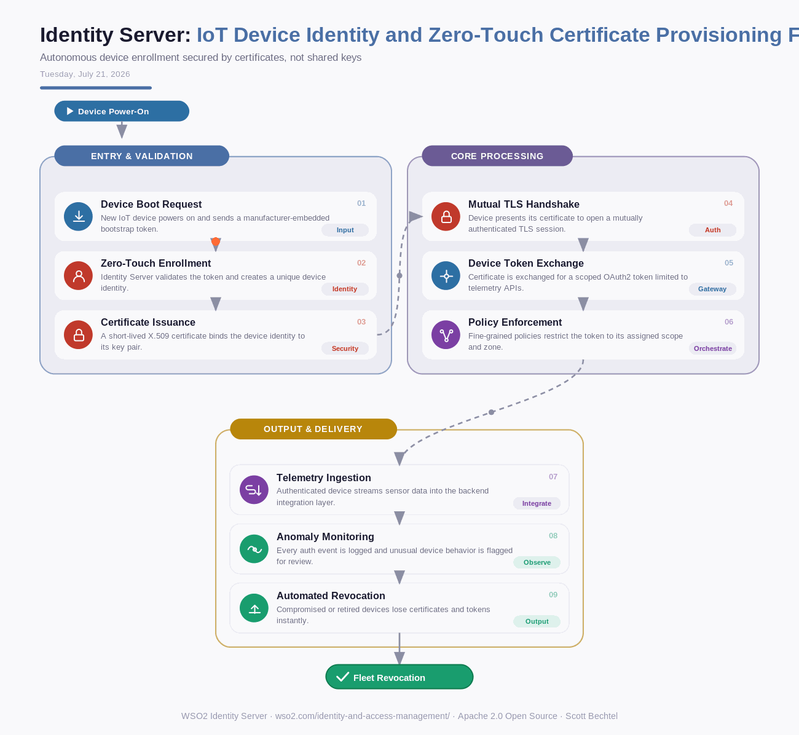

# Identity Server: IoT Device Identity and Zero-Touch Certificate Provisioning Flow
**Date:** Tuesday, July 21, 2026  **Product:** [Identity Server](https://wso2.com/identity-and-access-management/)

## Business Problem
Manufacturers shipping connected devices at scale can't rely on a factory worker typing in credentials for every unit, and shared API keys baked into firmware become a single point of failure the moment one device is cloned or reverse-engineered. Fleets also need a way to revoke a single compromised sensor without disrupting the other 50,000 devices sharing its product line.

## How WSO2 Solves This
WSO2 Identity Server treats every device as its own identity, not a shared credential riding along in firmware. A manufacturer-embedded bootstrap token gets a device enrolled and issued a short-lived X.509 certificate the moment it powers on, no human in the loop. From there, mutual TLS and scoped OAuth2 tokens keep each device locked to exactly the APIs it needs, while every authentication event feeds a monitoring layer that can revoke a single device's access in seconds if it starts behaving oddly.

## Patterns Used
- Zero-Touch Provisioning
- Mutual TLS (mTLS)
- Certificate-Based Authentication
- Fine-Grained Access Control (FGAC)

## Architecture

---
WSO2 Identity Server · wso2.com/identity-and-access-management/ · Auto Generated By AI
