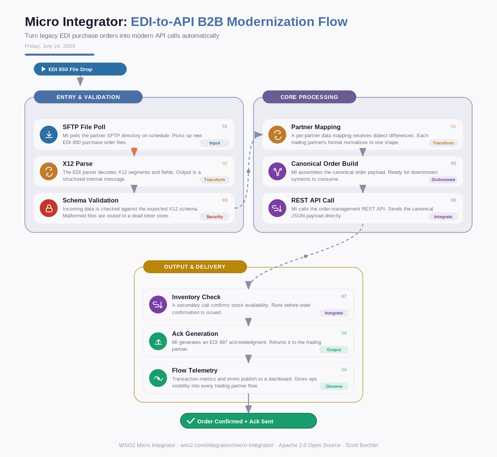

# Micro Integrator: EDI-to-API B2B Modernization Flow
**Date:** Friday, July 24, 2026  **Product:** [Micro Integrator](https://wso2.com/integration/micro-integrator/)

## Business Problem

A mid-size distributor still receives purchase orders from its biggest retail partners as EDI 850 X12 flat files dropped nightly on an SFTP server, while its new order-management platform only speaks REST/JSON. Every retailer wants faster turnaround and real-time order status, but the distributor can't ask 40 trading partners to rip out their EDI systems, and hand-coding a translator for each retailer's dialect eats a developer-quarter every time a new partner signs on.

## How WSO2 Solves This

WSO2 Micro Integrator sits between legacy EDI traffic and modern APIs without forcing either side to change. It polls the SFTP drop, parses X12/EDIFACT with built-in data mapping, and calls the same REST endpoints your order-management system already exposes — no bespoke connector per partner. Because it's Apache-licensed and deploys as a lightweight container, you can run it next to the mainframe today and move it to Kubernetes next year without re-platforming the integration logic. Add a new trading partner by mapping their dialect once, not by writing a new pipeline from scratch.

## Patterns Used

- Message Translator Pattern
- Canonical Data Model
- Content Enricher
- Dead Letter Channel

## Architecture

---
WSO2 Micro Integrator · wso2.com/integration/micro-integrator/ · Auto Generated By AI
