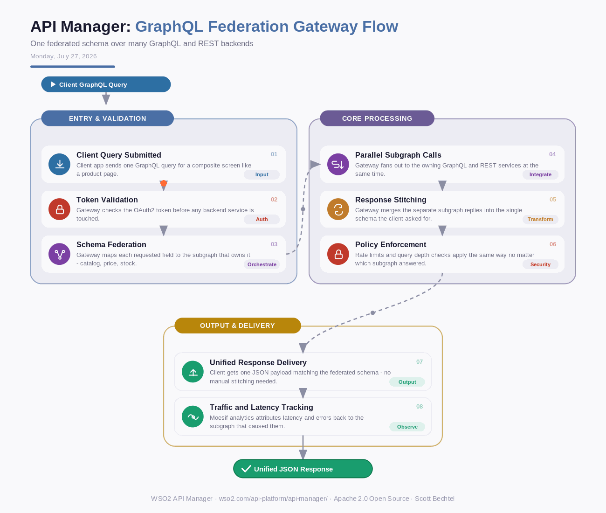

# API Manager: GraphQL Federation Gateway Flow
**Date:** Monday, July 27, 2026  **Product:** [API Manager](https://wso2.com/api-platform/api-manager/)

## Business Problem

Enterprises split product data across a dozen GraphQL and REST services, each owned by a different team - catalog, pricing, inventory, reviews. A single product page can need six separate backend calls, and client teams end up writing custom code just to stitch the responses together. When one backend team renames a field, every client app that touches it breaks.

## How WSO2 Solves This

WSO2 API Manager sits in front of every GraphQL and REST backend and exposes one federated schema to consumers. Backend teams keep shipping their own subgraphs on their own schedule - the gateway resolves the incoming query, fans it out to the right services, and stitches the results before the client ever sees them. One query in, one response out, with a single security and rate-limit policy enforced at the edge no matter which subgraph answered. Because API Manager is self-hosted and open source, the whole federation layer stays inside your network.

## Patterns Used

- GraphQL Federation
- API Composition Pattern
- Backend for Frontend (BFF)
- Centralized Policy Enforcement

## Architecture

---
WSO2 API Manager · wso2.com/api-platform/api-manager/ · by, Scott Bechtel
