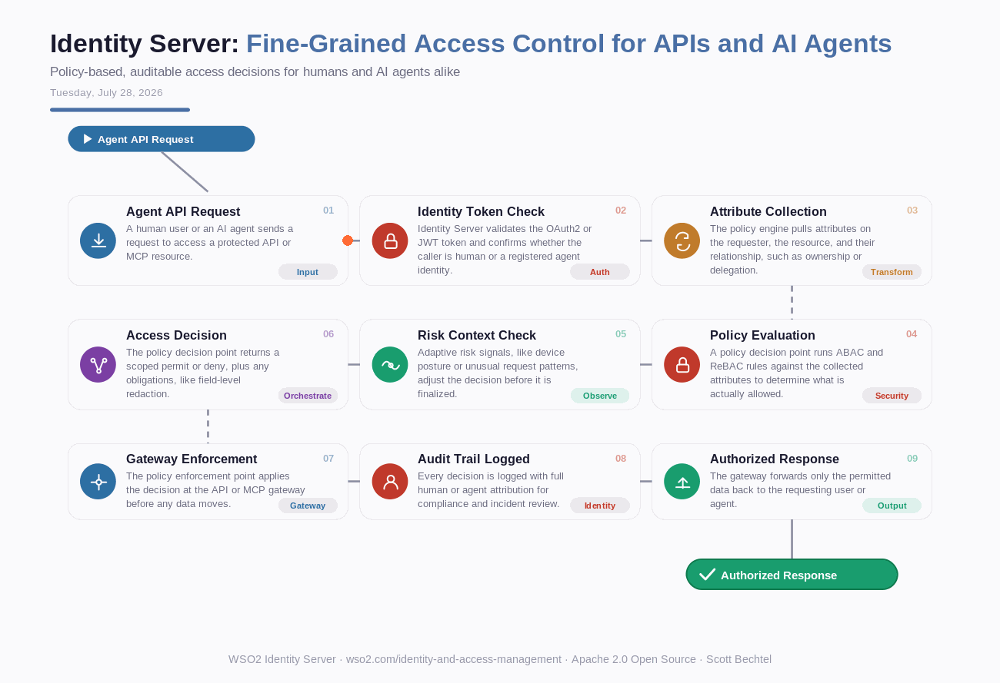

# Identity Server: Fine-Grained Access Control for APIs and AI Agents
**Date:** Tuesday, July 28, 2026  **Product:** [Identity Server](https://wso2.com/identity-and-access-management/)

## Business Problem
Enterprises now expose APIs and MCP servers to both employees and autonomous AI agents, but most identity systems still enforce access with roles built for humans. A support bot and a finance analyst can end up sharing the same "read" permission on a customer record, even though only one should ever see payment details. Auditors want proof of who, or what, touched sensitive data and why - role-based access control can't produce that proof.

## How WSO2 Solves This
WSO2 Identity Server replaces broad roles with policy-based decisions evaluated at request time. A policy decision point checks the requester's attributes, the resource's sensitivity, and the relationship between them, then hands a scoped permit or deny to the gateway enforcing it. The same engine covers a human logging into a dashboard and an AI agent calling an MCP tool, so one policy language governs both. Every decision gets logged with full attribution, turning "who has access" into "why did they get it, and can we prove it."

## Patterns Used
- Attribute-Based Access Control (ABAC)
- Relationship-Based Access Control (ReBAC)
- Policy Decision Point / Policy Enforcement Point (PDP/PEP)
- Zero Trust Security

## Architecture

WSO2 Identity Server · wso2.com/identity-and-access-management ·  by, Scott Bechtel
