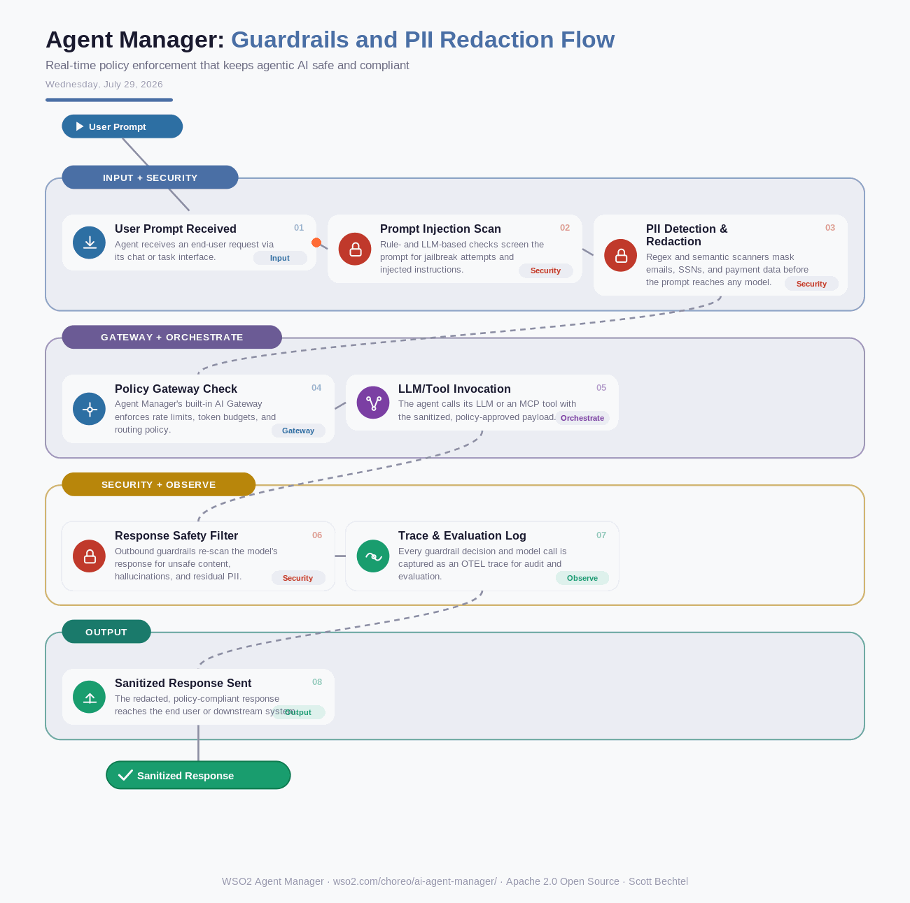

# Agent Manager: Guardrails and PII Redaction Flow
**Date:** Wednesday, July 29, 2026  **Product:** [Agent Manager](https://wso2.com/choreo/ai-agent-manager/)

## Business Problem
Enterprise agents built with frameworks like LangChain or CrewAI call LLMs and enterprise APIs directly, so a single unguarded prompt can leak customer PII, get hijacked by an injected instruction, or trigger a costly runaway tool call. With no centralized enforcement point, security teams often find out only after the fact, from a support ticket or an audit.

## How WSO2 Solves This
WSO2 Agent Manager puts a runtime guardrail layer in front of every agent, LLM, and MCP tool interaction — rule-based and LLM-based checks screen prompts and responses before they ever reach a model or a downstream system. Built-in PII detection redacts emails, SSNs, and payment data in both directions, while prompt-injection and content-safety filters block jailbreaks and unsafe outputs in real time. Every check emits an OTEL trace, giving security and platform teams one governed control plane instead of stitching guardrails into every agent framework by hand. It's built on WSO2's existing AI Gateway, so the same policies already protecting APIs extend naturally to agents.

## Patterns Used
- Zero Trust Runtime
- Guardrail Chain Pattern
- PII Masking/Tokenization
- OTEL Distributed Tracing

## Architecture

---
WSO2 Agent Manager · wso2.com/choreo/ai-agent-manager/ · Auto Generated By AI
