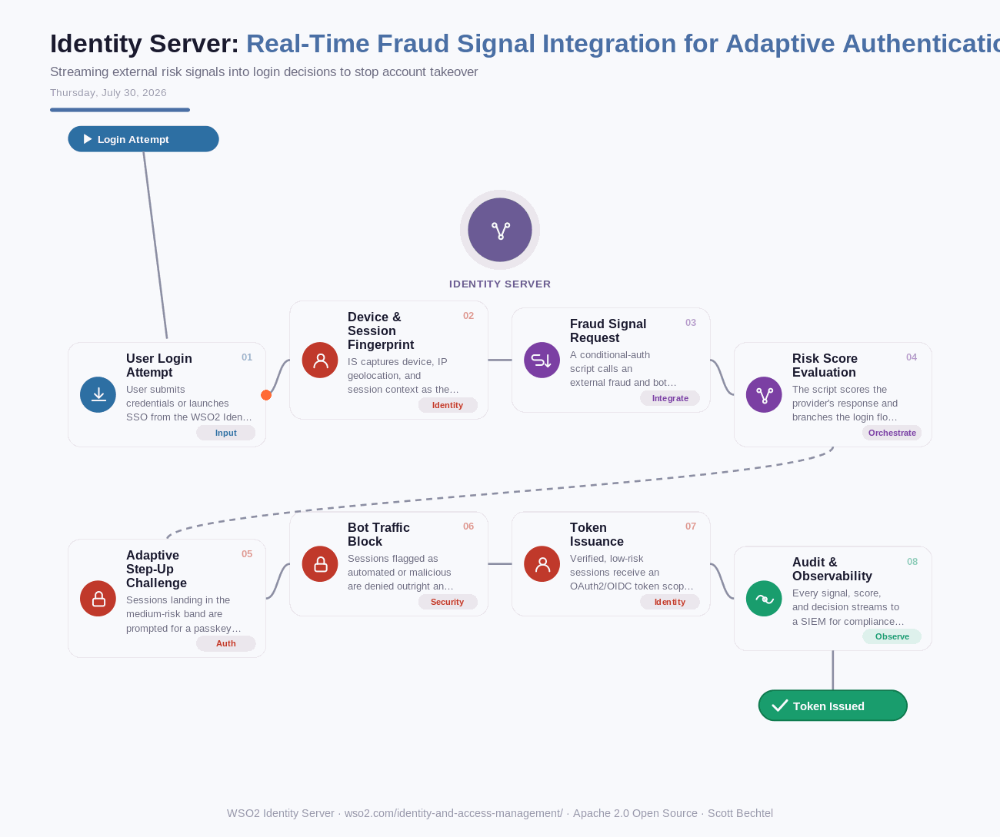

# Identity Server: Real-Time Fraud Signal Integration for Adaptive Authentication
**Date:** Thursday, July 30, 2026  **Product:** [Identity Server](https://wso2.com/identity-and-access-management/)

## Business Problem
Account takeover and credential-stuffing attacks keep slipping past static MFA policies. Enforce step-up authentication for every login and legitimate customers get frustrated; enforce it too rarely and bots and stolen credentials get a clean run. CIAM and financial services teams need risk scoring that reacts to the actual signal on each login attempt, not a fixed rule set.

## How WSO2 Solves This
WSO2 Identity Server's adaptive authentication framework plugs external fraud and bot detection providers directly into the login flow through conditional authentication scripts. As a session authenticates, IS gathers device, geolocation, and behavioral signals, sends them to the fraud provider, and branches the flow based on the returned risk score — step up with a passkey or OTP, block outright, or issue a token, all without hard-coding logic into the application. Because the scoring logic lives in an extensible script, you're not locked into a single fraud vendor.

## Patterns Used
- Adaptive Authentication Pattern
- Risk-Based Access Control
- Zero Trust Security Model

## Architecture

---
WSO2 Identity Server · wso2.com/identity-and-access-management/ · Auto Generated By AI
