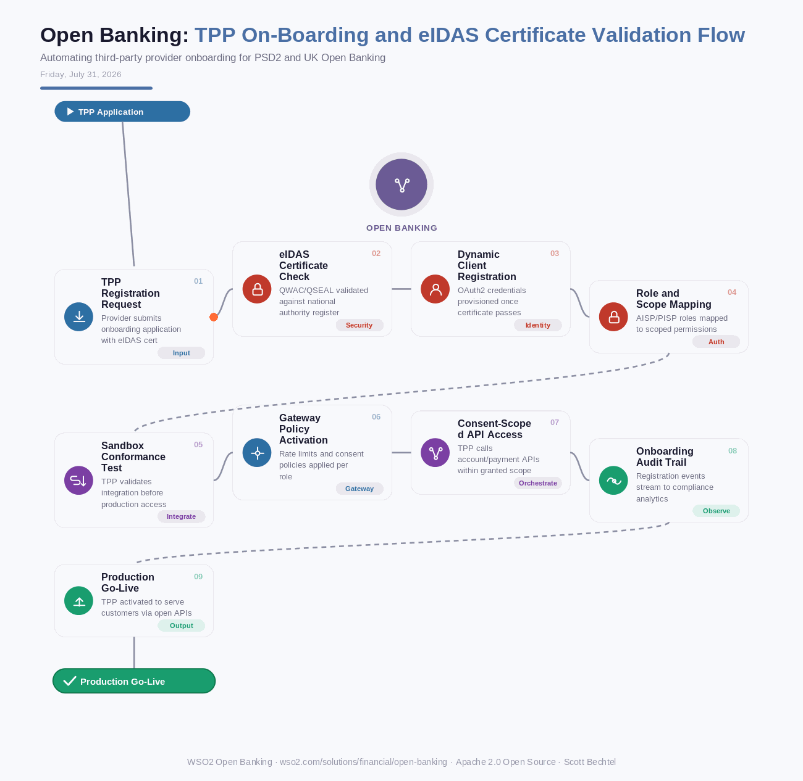

# Open Banking: TPP On-Boarding and eIDAS Certificate Validation Flow
**Date:** Friday, July 31, 2026  **Product:** [Open Banking](https://wso2.com/solutions/financial/open-banking/)

## Business Problem
Third-party providers entering an open banking ecosystem must prove their regulatory identity before they can call a single account or payment API, and manually verifying eIDAS QWAC/QSEAL certificates against national competent authority registers doesn't scale past a handful of partners. Banks that skip automated onboarding either block legitimate fintechs for weeks or expose consent APIs to unverified callers, and both outcomes carry regulatory and reputational risk under PSD2 and UK Open Banking rules.

## How WSO2 Solves This
WSO2 Open Banking pairs its API-first integration stack with FAPI-certified security to turn TPP onboarding into a repeatable, automated pipeline. Dynamic Client Registration validates each applicant's eIDAS QWAC certificate against the national competent authority register in real time, then provisions scoped OAuth2 credentials without a human in the loop. Built-in role and consent scoping keeps AISP and PISP permissions separate from day one, and every registration event feeds the analytics layer so compliance teams can audit onboarding at any point. New fintech partners go from application to first API call in minutes, not weeks.

## Patterns Used
- Dynamic Client Registration (RFC 7591)
- eIDAS QWAC/QSEAL Certificate Validation
- FAPI (Financial-grade API) Security Profile
- Scoped Consent Authorization

## Architecture

WSO2 Open Banking · wso2.com/solutions/financial/open-banking · Apache 2.0 Open Source · by, Scott Bechtel
