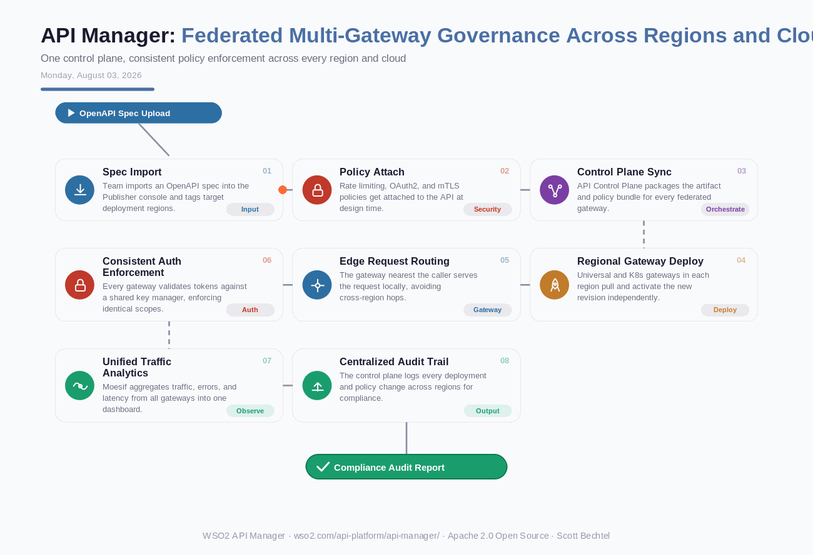

# API Manager: Federated Multi-Gateway Governance Across Regions and Clouds
**Date:** Monday, August 03, 2026  **Product:** [API Manager](https://wso2.com/api-platform/api-manager/)

## Business Problem
Enterprises running WSO2 API Manager across multiple regions and clouds — say, on-prem in the EU, AWS in the US, Azure in APAC — end up with fragmented policy enforcement and duplicated key managers. A rate-limiting change made in one region doesn't automatically apply to the others, and pulling a single compliance report means stitching together logs from a dozen separate gateways.

## How WSO2 Solves This
WSO2's API Control Plane separates policy authoring from gateway execution. Design and attach policies once in a central Publisher console, then push that artifact and policy bundle out to every federated gateway — Universal or Kubernetes, in any region or cloud. Each gateway serves requests locally against a shared key manager, so authentication and throttling stay consistent no matter where the call lands. Moesif rolls traffic, error, and latency data from all gateways into a single dashboard, and the control plane keeps one audit trail of every deployment and policy change across the whole federation.

## Patterns Used
- Control Plane / Data Plane Separation
- Gateway Federation
- Policy-as-Code
- Edge Deployment Pattern

## Architecture

---
WSO2 API Manager · wso2.com/api-platform/api-manager/ ·  by, Scott Bechtel
