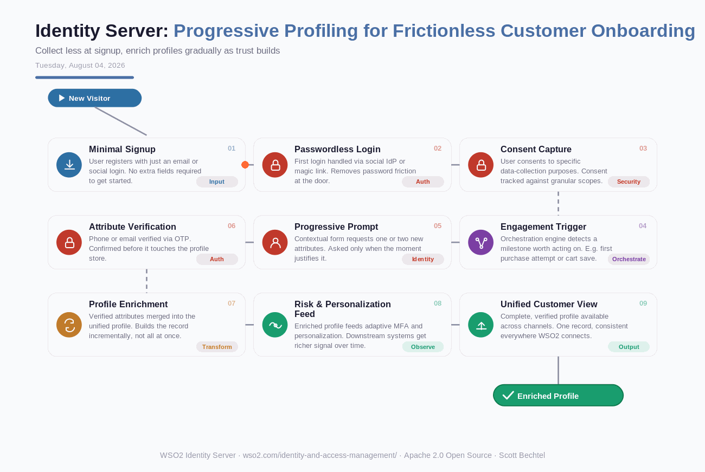

# Identity Server: Progressive Profiling for Frictionless Customer Onboarding
**Date:** Tuesday, August 04, 2026  **Product:** [Identity Server](https://wso2.com/identity-and-access-management/)

## Business Problem
Consumer apps lose signups when a registration form asks for too much up front, but a bare-bones profile leaves fraud scoring and personalization with nothing to work from. Teams need a way to onboard with almost no friction and then fill in the profile as the relationship earns it, without repeat logins or clunky mid-journey forms.

## How WSO2 Solves This
WSO2 Identity Server lets a customer sign up with just an email or a social login, then uses identity orchestration to decide when a moment in the journey — a first purchase, a saved cart, a support request — justifies asking for one more piece of information. Each prompt is contextual and verified on the spot, so the profile grows in small, trusted steps instead of one long form. By the time a customer needs adaptive MFA or personalized recommendations, the data is already there, verified and consented.

## Patterns Used
- Progressive Profiling
- Identity Orchestration
- Consent-Based Data Minimization
- OTP Step-Up Verification

## Architecture

---
WSO2 Identity Server · wso2.com/identity-and-access-management/ · Auto Generated By AI
