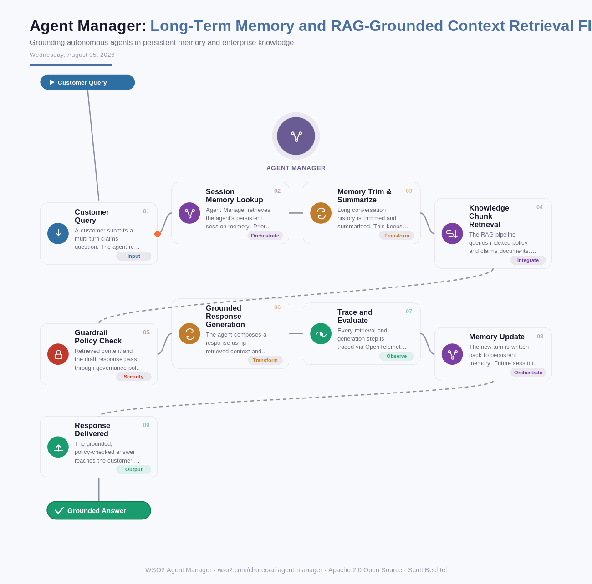

# Agent Manager: Long-Term Memory and RAG-Grounded Context Retrieval Flow
**Date:** Wednesday, August 05, 2026  **Product:** [Agent Manager](https://wso2.com/choreo/ai-agent-manager/)

## Business Problem
Enterprise agents deployed at scale routinely lose context between sessions and hallucinate when they can't ground answers in proprietary data. A claims-processing agent that forgets a customer's prior turns, or cites an outdated policy document instead of the current version, erodes trust and pushes handle time right back onto human support staff.

## How WSO2 Solves This
WSO2 Agent Manager gives agents persistent memory with automatic trimming and summarization, so state carries across sessions without bloating the context window. Built-in RAG pipelines ingest and chunk enterprise knowledge, index it, and retrieve grounded context at inference time — all governed through the same control plane that traces, evaluates, and enforces policy on every agent interaction. Because retrieval and memory are first-class platform capabilities, agents built in LangChain, CrewAI, or any framework register once and get consistent, auditable grounding.

## Patterns Used
- Retrieval-Augmented Generation
- Memory Trim & Summarization
- Policy-as-Code Guardrails
- Distributed Tracing (OpenTelemetry)

## Architecture

---
WSO2 Agent Manager · wso2.com/choreo/ai-agent-manager ·  by, Scott Bechtel
