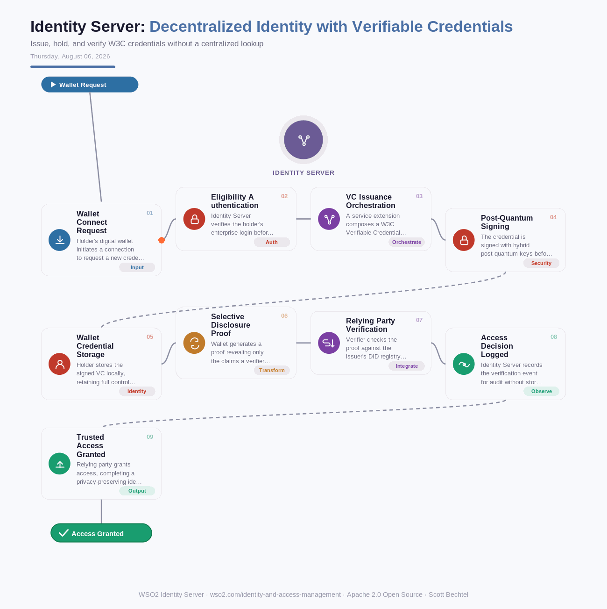

# Identity Server: Decentralized Identity with Verifiable Credentials
**Date:** Thursday, August 06, 2026  **Product:** [Identity Server](https://wso2.com/identity-and-access-management/)

## Business Problem

Enterprises issuing digital credentials — diplomas, professional licenses, KYC attestations — still lean on centralized databases that every verifier has to query in real time, creating a single point of failure and a privacy leak, since each check reveals which relying party is looking up which person. Citizens and business partners increasingly want to hold verifiable credentials in their own wallet and present only the claims a verifier actually needs, but most CIAM systems have no native path for DID-based issuance or selective disclosure. Without an orchestration layer binding issuers, holders, and verifiers together, these efforts stay stuck as disconnected pilots that never clear a compliance audit.

## How WSO2 Solves This

WSO2 Identity Server's extensible authentication engine and service extension framework let you script custom flows for issuing, presenting, and verifying W3C Verifiable Credentials without forking core code. Because Identity Server already federates external identity providers and exposes identity orchestration APIs, it can act as the trust anchor binding a holder's DID-based wallet to real login sessions and access decisions. Add its post-quantum-ready cryptography, and the credential exchange stays audit-ready even as verification volume grows.

## Patterns Used

- Decentralized Identifier (DID) Trust Model
- Verifiable Credentials (W3C VC Data Model)
- Selective Disclosure Proof
- Post-Quantum Hybrid Cryptography

## Architecture

---
WSO2 Identity Server · wso2.com/identity-and-access-management · Auto Generated By AI
