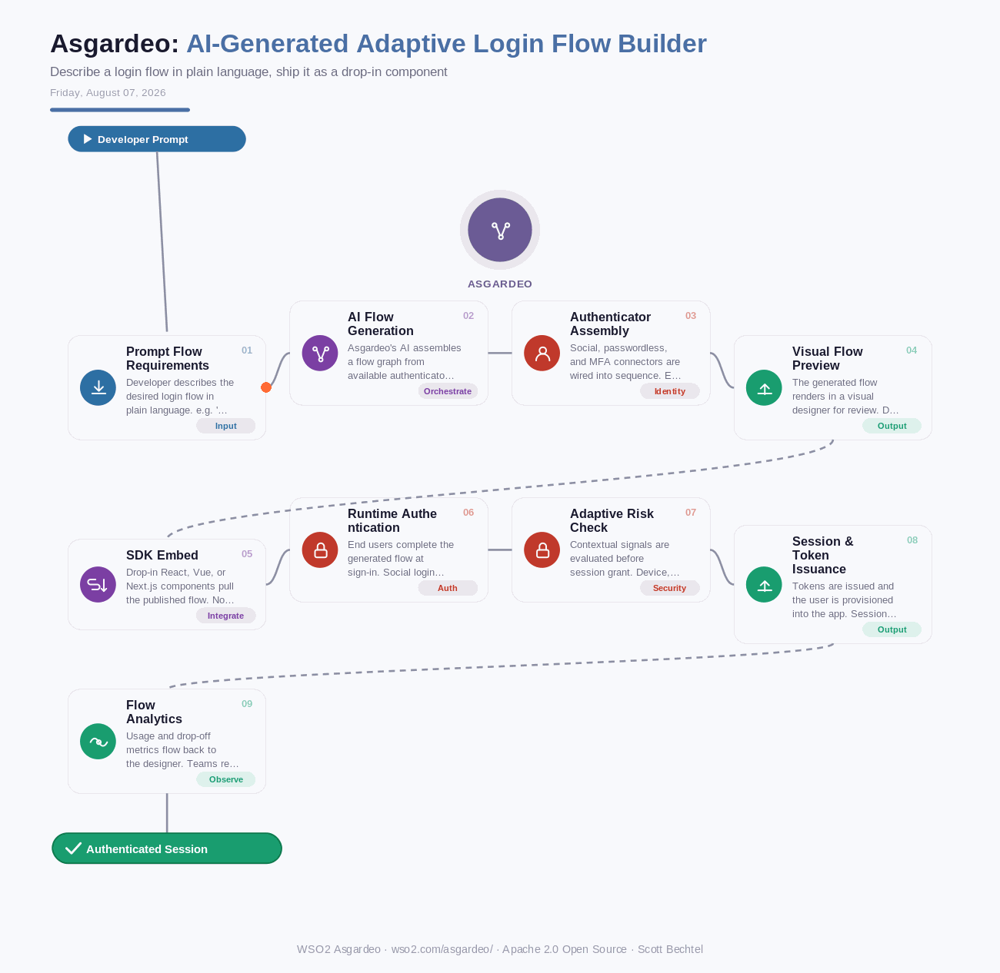

# Asgardeo: AI-Generated Adaptive Login Flow Builder
**Date:** Friday, August 07, 2026  **Product:** [Asgardeo](https://wso2.com/asgardeo/)

## Business Problem

Product teams building consumer or B2B apps need login and signup flows that add social login, MFA, and passwordless options fast, often across a dozen client apps at once. Most teams don't have identity engineers on staff to hand-code every flow variant, and the resulting backlog delays launches while security debt piles up in the meantime.

## How WSO2 Solves This

Asgardeo lets a developer describe the flow they want in plain language, like "Google login plus SMS OTP as a second factor," and its AI assembles the authenticator chain automatically. The generated flow lands in a visual designer for review and tweaks before it's published. From there, drop-in SDK components for React, Vue, and Next.js pull the flow straight into the app without redirect-only integration. Flow analytics then close the loop, showing exactly where users drop off so the flow can be refined with real data instead of guesswork.

## Patterns Used

- Declarative Flow Orchestration
- Adaptive Multi-Factor Authentication
- Composable Authenticator Chaining
- Continuous Flow Analytics (Observability Loop)

## Architecture

---
WSO2 Asgardeo · wso2.com/asgardeo/ · Auto Generated By AI
