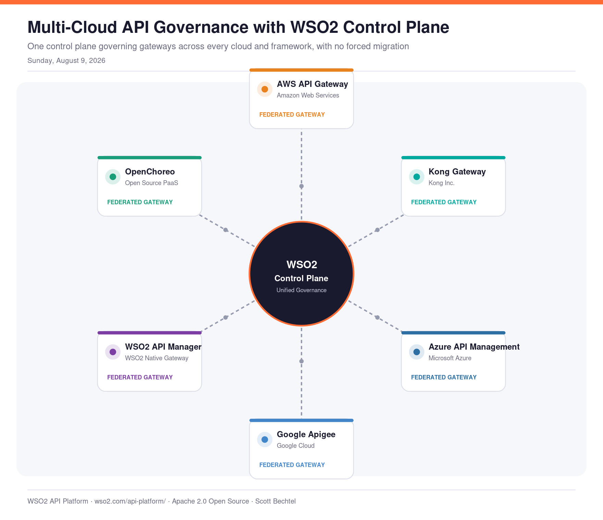
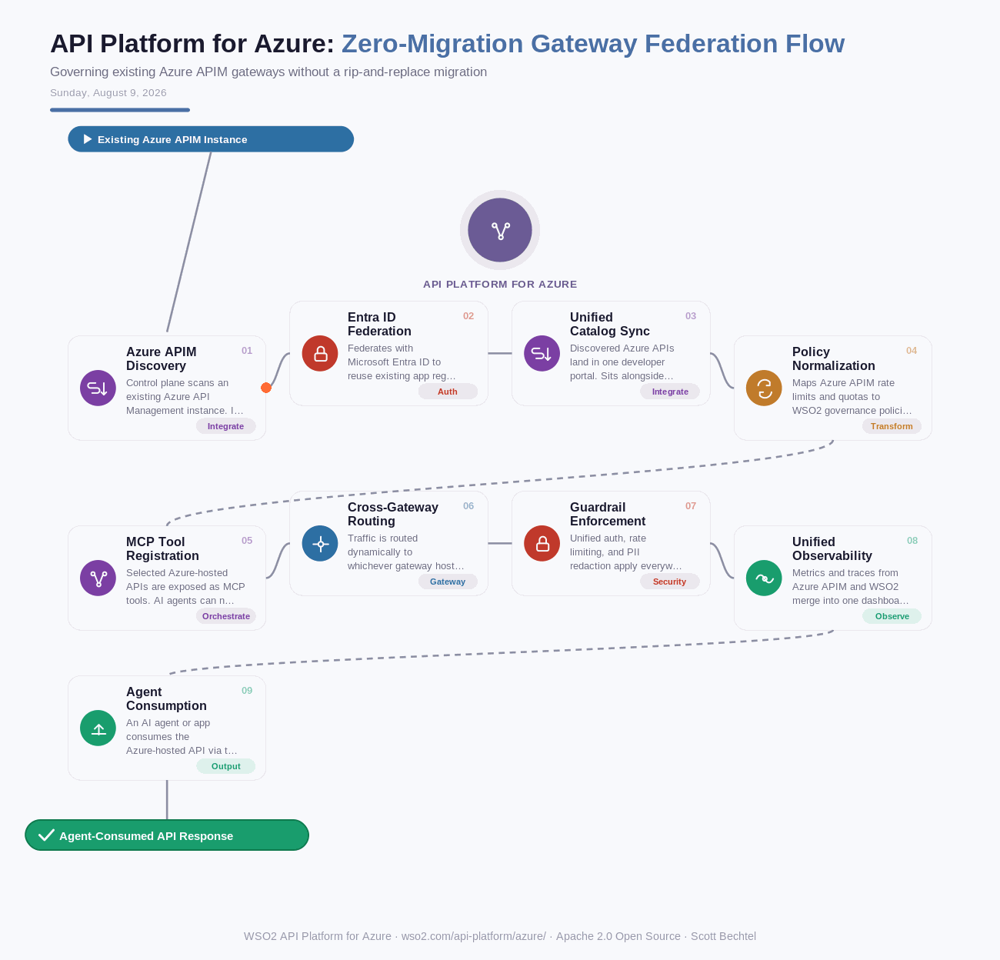

# API Platform for Azure: Zero-Migration Gateway Federation Flow
**Date:** Sunday, August 9, 2026  **Product:** [API Platform for Azure](https://wso2.com/api-platform/azure/)

## Business Problem
Enterprises running Azure API Management already have hundreds of production APIs in place, and migrating them to a new platform just to make them AI-agent-ready is too risky and too disruptive to justify. At the same time, the push toward AI agents means every one of those existing Azure-hosted APIs also needs to be discoverable, governed, and secured for LLM and agent consumption — without a rip-and-replace project.

## How WSO2 Solves This
WSO2 API Platform connects to an existing Azure API Management instance in place, discovering the APIs already running there and pulling them under one control plane alongside WSO2's own gateway, Kong, and AWS. Rather than forcing a migration, it federates governance, policy enforcement, and observability across every gateway, then layers on AI-agent readiness — MCP tool registration, unified guardrails, cost and usage tracking — so legacy Azure APIs become consumable by agents with zero re-deployment.

## Patterns Used
- Gateway Federation Pattern
- Policy-as-Code Normalization
- MCP Tool Registration
- Zero Trust Security

## Architecture

---
WSO2 API Platform for Azure · wso2.com/api-platform/azure/ · Auto Generated By AI
