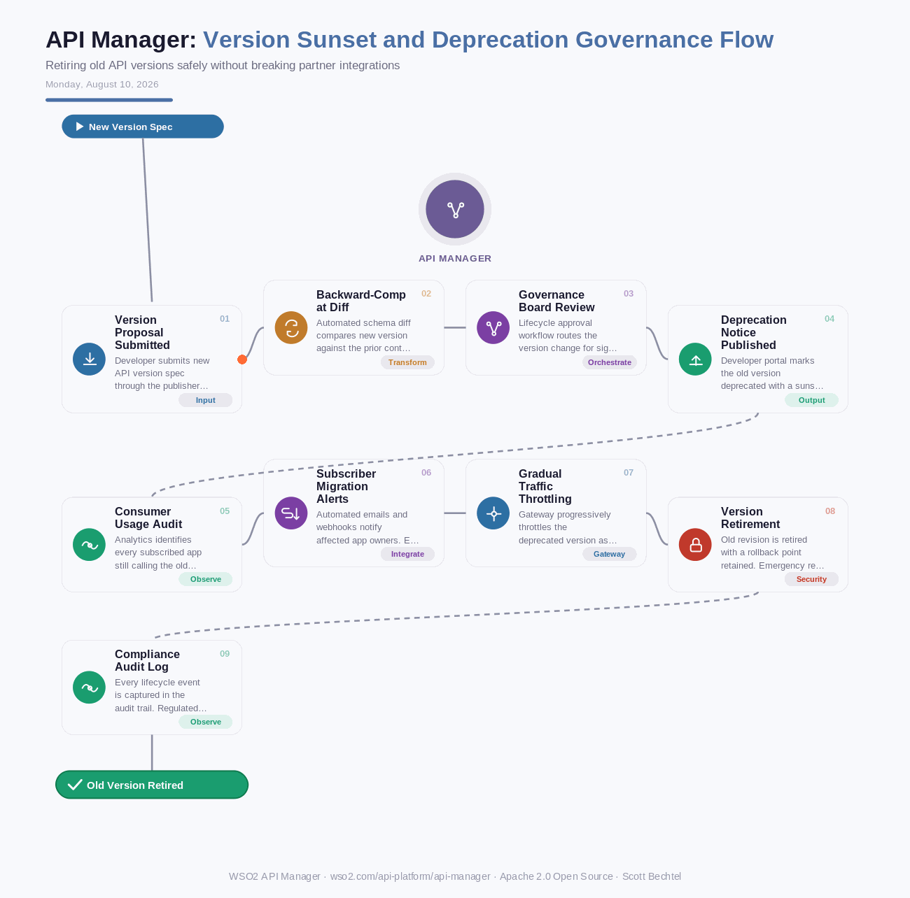

# API Manager: Version Sunset and Deprecation Governance Flow
**Date:** Monday, August 10, 2026  **Product:** [API Manager](https://wso2.com/api-platform/api-manager/)

## Business Problem
Most enterprises run several API versions in production at once, and retiring the old ones is where things go wrong. Partner integrations keep quietly calling stale endpoints, breaking changes slip out without warning, and there's rarely a clean audit trail showing who approved what and when. Sunsetting a version without a governed process risks breaking the very partners the API was built to serve.

## How WSO2 Solves This
WSO2 API Manager Server treats deprecation as a first-class lifecycle state, not an afterthought. Every version change runs through automated backward-compatibility checks and a governance approval workflow before a sunset date ever gets published. The developer portal surfaces deprecation banners and try-it console warnings directly to consumers, while analytics identifies exactly which subscribed apps are still on the old version. Gateways throttle deprecated traffic gradually instead of cutting it off, and revision-based deployment keeps a rollback point in reserve the whole way through.

## Patterns Used
- Semantic Versioning
- Progressive Traffic Throttling
- Sunset Header Pattern (RFC 8594)
- Audit Trail / Event Sourcing

## Architecture

WSO2 API Manager · wso2.com/api-platform/api-manager · Auto Generated By AI
