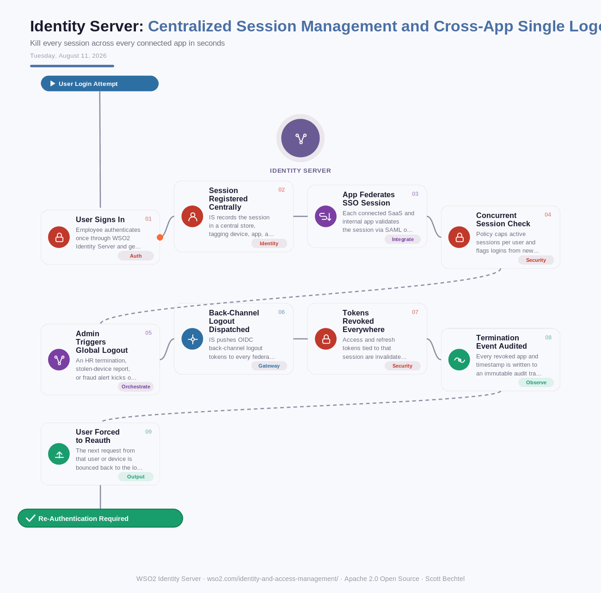

# Identity Server: Centralized Session Management and Cross-App Single Logout
**Date:** Tuesday, August 11, 2026  **Product:** [Identity Server](https://wso2.com/identity-and-access-management/)

## Business Problem

A contractor gets terminated at 9am, but their laptop still holds a live SSO session in Salesforce, Confluence, and four other connected apps until each token happens to expire on its own - sometimes hours later. Security can revoke access at the identity provider in seconds, but every app that trusted that session keeps trusting it until it bothers to check again. That gap between "revoked at the IdP" and "actually logged out everywhere" is exactly where stolen devices and insider threats do their damage.

## How WSO2 Solves This

WSO2 Identity Server treats session revocation as a broadcast, not a hope. The moment an admin - or an automated HR termination trigger - kills a session, IS fires OIDC back-channel logout calls to every federated app and revokes every access and refresh token tied to that session at the source, not just at the login screen. You get one control plane for session state across dozens of apps, instead of trusting each app to eventually notice the user is gone. It's the difference between a fire alarm that rings in every room and one that only rings where the fire started. Every revoked app and timestamp lands in an audit trail, so compliance isn't a scramble after the fact.

## Patterns Used
- OIDC Back-Channel Logout
- Single Logout (SLO)
- Token Revocation Cascade
- Concurrent Session Throttling

## Architecture

---
WSO2 Identity Server · wso2.com/identity-and-access-management/ ·  by, Scott Bechtel
