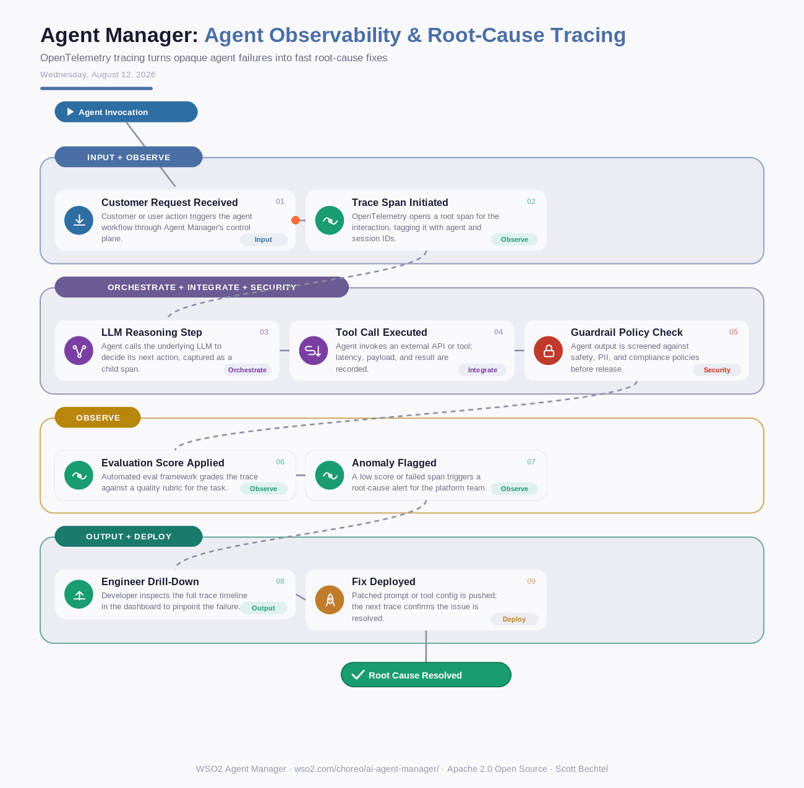

# Agent Manager: Agent Observability: End-to-End Tracing and Root-Cause Analysis
**Date:** August 12, 2026  **Product:** [Agent Manager](https://wso2.com/choreo/ai-agent-manager/)

## Business Problem
Enterprises running production agents built on LangChain, LangGraph, or CrewAI lose visibility the moment something goes wrong. A customer-facing agent quotes the wrong price or takes an unexpected action, and engineers are left grepping logs across a dozen services trying to reconstruct what the agent actually decided, which tool it called, and why. Without a single trace to follow, root-causing a bad agent decision can eat an entire afternoon.

## How WSO2 Solves This
WSO2 Agent Manager applies OpenTelemetry-based, zero-code instrumentation across popular agent frameworks, capturing every LLM call, tool invocation, and decision as a structured trace. Engineers can open a single request end-to-end, replay the exact sequence of reasoning and tool calls, and lean on a built-in evaluation framework that scores each trace against a quality rubric. When a score drops or a span fails, the platform surfaces it immediately instead of waiting for a customer complaint. It's the same visibility APM tools gave teams over microservices, now applied to autonomous agents.

## Patterns Used
- OpenTelemetry Distributed Tracing
- Zero-Code Instrumentation
- Evaluation-Driven Quality Gates

## Architecture

WSO2 Agent Manager · wso2.com/choreo/ai-agent-manager/ ·  by, Scott Bechtel
