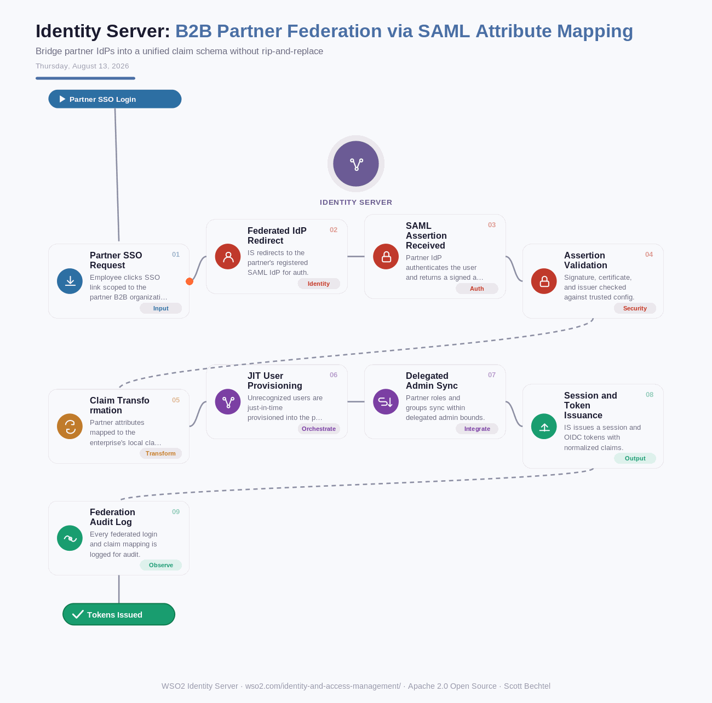

# Identity Server: B2B Partner Federation via SAML Attribute Mapping
**Date:** Thursday, August 13, 2026  **Product:** [Identity Server](https://wso2.com/identity-and-access-management/)

Feature Link: [Configure SAML federated IdP-Initiated Single Sign-On (SSO)](https://wso2.com/identity-platform/docs/guides/authentication/saml/saml-federated-idp-initiated-sso/)

## Business Problem
Enterprises onboarding a new B2B partner often find the partner's employees already live in their own corporate IdP (Okta, Azure AD, ADFS), authenticating via SAML 2.0. The catch: the partner's attribute schema (department, role, employee ID) rarely lines up with the enterprise's internal claim dictionary, which breaks downstream authorization decisions and forces manual attribute wrangling for every new partner integration.

## How WSO2 Solves This
WSO2 Identity Server acts as an identity broker, registering the partner's SAML IdP as a federated authenticator scoped to that partner's B2B organization. Incoming SAML assertions pass through configurable claim transformation rules that normalize partner attributes into the enterprise's local schema before a session or token is ever issued. Just-in-time provisioning creates the local user record on first login, and delegated administration lets the partner manage their own users while the enterprise retains centralized policy control.

## Patterns Used
- SAML 2.0 Federation
- Claim Transformation
- Identity Brokering
- Just-In-Time (JIT) Provisioning

## Architecture

---
WSO2 Identity Server · wso2.com/identity-and-access-management/ · Auto Generated By AI
