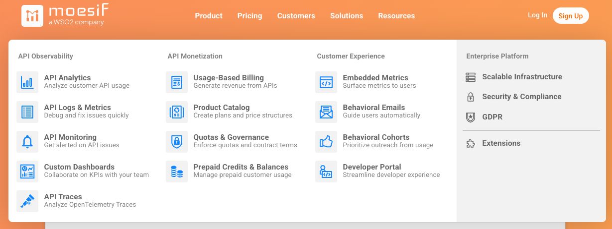
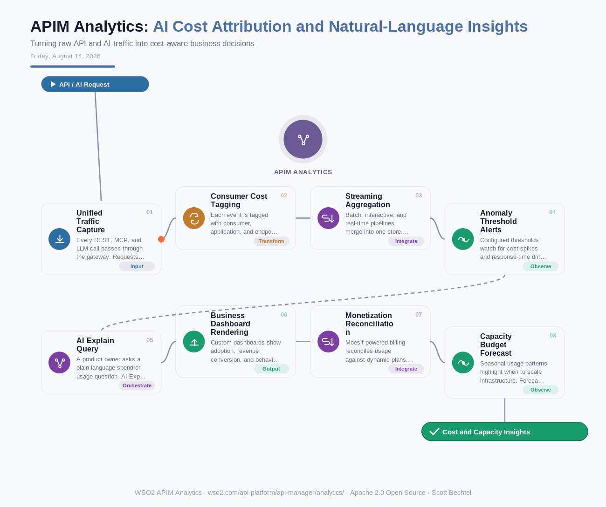

# APIM Analytics: AI Cost Attribution and Natural-Language Insights
**Date:** Friday, August 14, 2026  **Product:** [APIM Analytics](https://wso2.com/api-platform/api-manager/analytics/)

## Business Problem
Once teams start routing LLM calls and MCP tool traffic through the same gateway as their REST APIs, the bill arrives as one lump sum with no breakdown by team, app, or customer. Product owners get asked which feature drove last month's token spend, and the honest answer is a shrug, because the data lives in three different logging systems. Finance ends up allocating AI costs by guesswork, and by the time anyone notices a runaway agent burning tokens, the invoice has already posted.

## How WSO2 Solves This Using Moesif
WSO2 API Manager Analytics tags every request, whether it is a REST call, an MCP tool invocation, or a call to an LLM, with the consumer, application, and per-token cost that produced it. Moesif-powered analytics roll that data into dashboards that show adoption, developer behavior, and revenue conversion side by side with spend, and AI Explain lets a product owner type a plain-language question instead of writing a query. Threshold alerts catch a cost spike or a throttling pattern before it becomes a surprise line item, and the same usage data feeds directly into dynamic, usage-based billing plans. It is one analytics pipeline doing the job that used to take three dashboards and a spreadsheet.

## Patterns Used
- Streaming Aggregation Pattern
- Natural Language Query Translation
- Usage-Based Metering Pattern
- Threshold-Based Alerting Pattern

## Architecture

---
WSO2 APIM Analytics · wso2.com/api-platform/api-manager/analytics/ ·  by, Scott Bechtel
