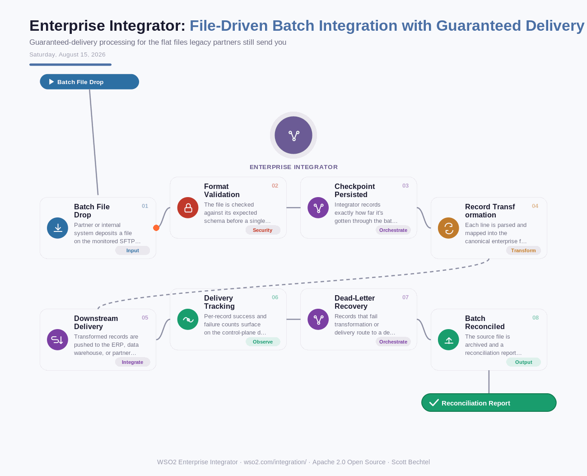

# Enterprise Integrator: File-Driven Batch Integration with Guaranteed Delivery
**Date:** Saturday, August 15, 2026  **Product:** [Enterprise Integrator](https://wso2.com/integration/)

## Business Problem
Banks and logistics partners still hand off huge volumes of data as flat files — nightly settlement batches, EDI 850s, CSV drops from a partner's SFTP server — because ripping out that pipeline isn't happening this decade. The problem shows up when a batch fails halfway through: a partial write into the ERP, a settlement file that's 40% processed, and someone spends their Saturday morning reconciling row counts by hand. Miss it, and the discrepancy surfaces three days later as a customer complaint.

## How WSO2 Solves This
WSO2 Integrator treats a file drop the same way it treats an API call: as a message that gets validated, transformed, and delivered with the same guarantees. A VFS/SFTP listener picks up the file, checkpoints its position, and routes every record through the same EIP-compliant mediation engine used for API and event traffic — so a failure at record 4,000 of 10,000 means resuming from the checkpoint, not starting over. Failed records route to a dead-letter queue for review instead of vanishing. It's the same 600+ connector library and control-plane visibility available on the API side, just pointed at your batch files instead of your endpoints — open source, self-hostable, and built to sit next to (or replace) the TIBCO/MuleSoft file adapters most integration teams inherited.

## Patterns Used
- Dead Letter Channel
- Idempotent Consumer
- Content Enricher
- Canonical Data Model

## Architecture

---
WSO2 Enterprise Integrator · wso2.com/integration/ ·  by, Scott Bechtel
