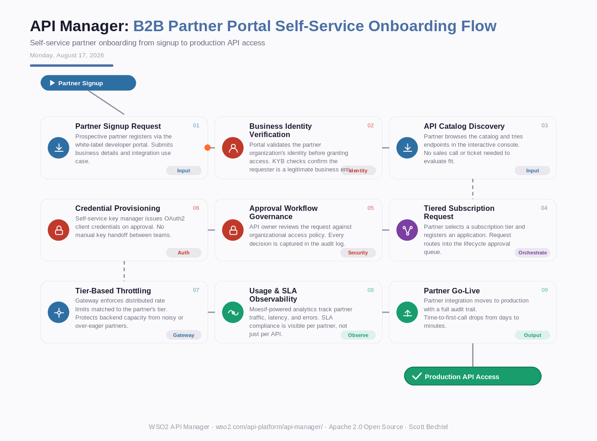

# API Manager: B2B Partner Portal Self-Service Onboarding Flow
**Date:** Monday, August 17, 2026  **Product:** [API Manager](https://wso2.com/api-platform/api-manager/)

## Business Problem
Regulated enterprises onboard dozens of external partners onto their APIs, but manual credential issuance and tier assignment create days-long delays between partner signup and first successful call. Security teams end up as a bottleneck, manually vetting every subscription request instead of enforcing policy through automated governance.

## How WSO2 Solves This
WSO2 API Manager's white-label developer portal lets partners register, browse the API catalog, and try endpoints before a human ever gets involved. Lifecycle approval workflows keep API owners in the loop for governance without turning every request into a support ticket, and self-service key management issues OAuth2 credentials the moment a subscription clears review. Because it's Apache 2.0 and self-hosted, financial services and government teams get partner self-service without handing subscriber data to a third-party SaaS portal.

## Patterns Used
- Self-Service Onboarding
- Approval Workflow Governance
- Tiered Rate Limiting
- White-Label Developer Portal

## Architecture

---
WSO2 API Manager · wso2.com/api-platform/api-manager/ ·  by, Scott Bechtel
