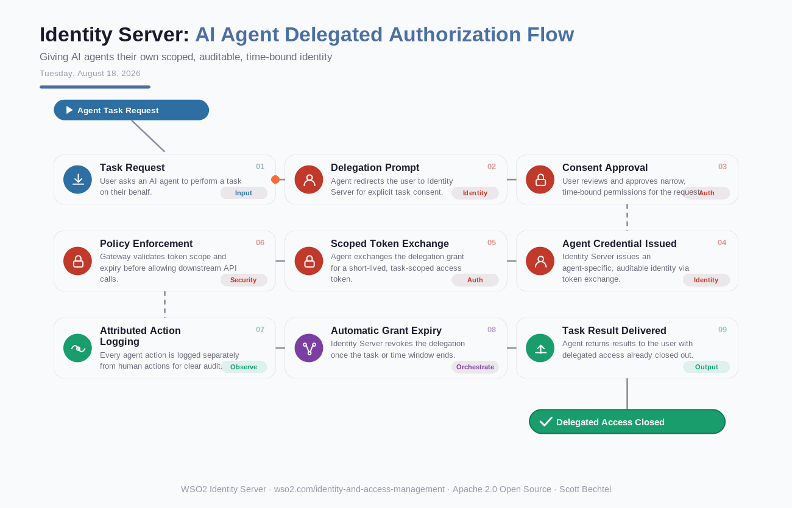

# Identity Server: AI Agent Delegated Authorization Flow
**Date:** Tuesday, August 18, 2026  **Product:** [Identity Server](https://wso2.com/identity-and-access-management/)

## Business Problem
Enterprises rolling out AI agents to act on behalf of employees or customers face an attribution gap: agents typically borrow a human's static credentials or a shared service account. That makes it impossible to scope what the agent can do, for how long, or to revoke its access without breaking the human's own session — and when an agent overreaches, auditors can't tell whether it was the human or the agent behind the action.

## How WSO2 Solves This
WSO2 Identity Server treats AI agents as first-class identities instead of hidden service accounts, issuing each agent its own auditable credential distinct from the human it acts for. Using OAuth 2.0 token exchange, a user grants an agent a narrow, time-bound scope for a single task, and that grant automatically expires once the task or window ends. Every agent action is logged separately from human actions in the same platform used for workforce and customer identity, giving security teams one control plane instead of a sprawl of API keys and shared logins.

## Patterns Used
- OAuth 2.0 Token Exchange
- Time-Bound Delegated Authorization
- Rich Authorization Requests (RAR)
- Zero Trust Security

## Architecture

---
WSO2 Identity Server · wso2.com/identity-and-access-management ·  by, Scott Bechtel
