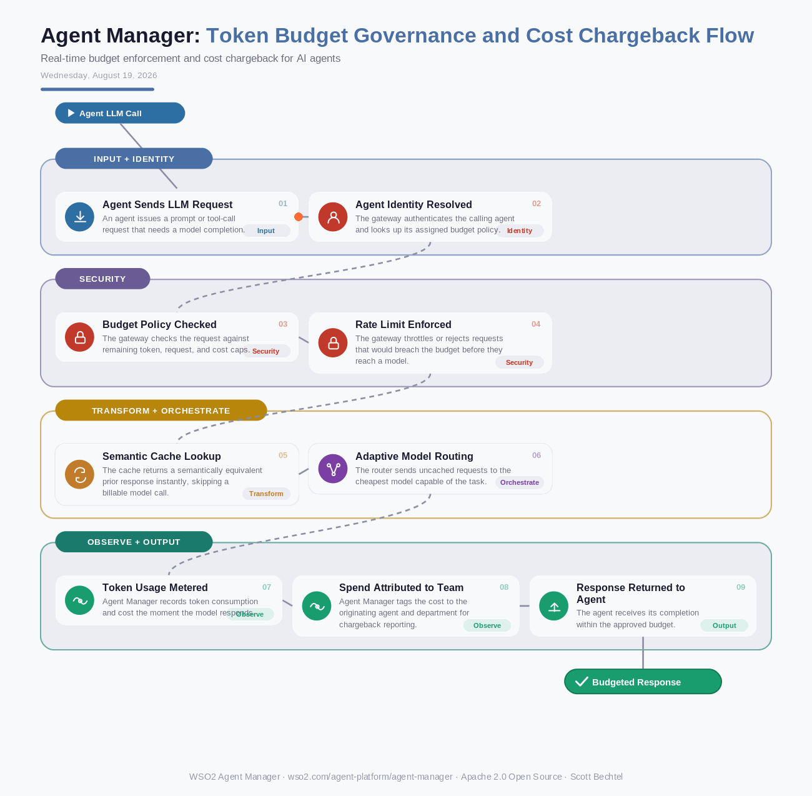

# Agent Manager: Token Budget Governance and Cost Chargeback Flow
**Date:** Wednesday, August 19, 2026  **Product:** [Agent Manager](https://wso2.com/agent-platform/agent-manager/)

## Business Problem

A single agent stuck in a retry loop, or one team defaulting to a premium model when a cheaper one would do, can burn through a month's LLM budget in an afternoon. Finance finds out on the invoice, not in real time. Nobody can trace the spend back to the agent, team, or business unit that caused it.

## How WSO2 Solves This

WSO2 Agent Manager enforces budgets inside the request path, not after the fact. Every agent-to-LLM call passes through token-based rate limiting, semantic caching, and adaptive model routing before it gets billed, so caps trigger in real time instead of at month's end. Usage and cost roll up per agent and per department on one dashboard, giving finance real chargeback instead of a shared bill nobody can explain. It runs on WSO2's Apache 2.0 AI Gateway, so the same enforcement applies whether the agent lives in Agent Manager, Bedrock, or LangSmith.

## Patterns Used

- Token Bucket Rate Limiting
- Semantic Caching
- Adaptive Model Routing
- Cost Attribution / Chargeback Pattern

## Architecture

---
WSO2 Agent Manager · wso2.com/agent-platform/agent-manager · by, Scott Bechtel
