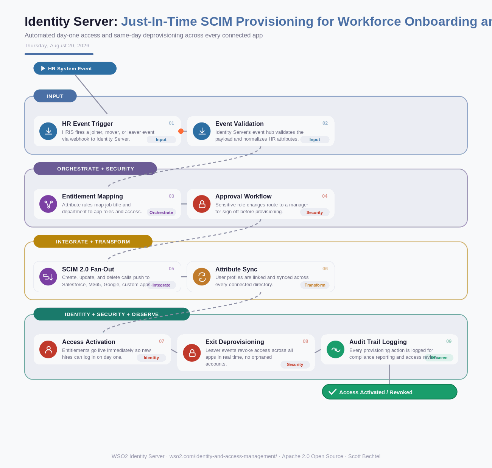

# Identity Server: Just-In-Time SCIM Provisioning for Workforce Onboarding and Offboarding
**Date:** Thursday, August 20, 2026  **Product:** [Identity Server](https://wso2.com/identity-and-access-management/)

## Business Problem
Mid-size enterprises onboard and offboard hundreds of employees a month across Salesforce, Microsoft 365, Google Workspace, and a dozen internal apps. When HR system changes don't reach every downstream app on day one, new hires sit locked out of tools they need, and departing employees keep active accounts for days after their last day — an audit finding waiting to happen.

## How WSO2 Solves This
WSO2 Identity Server treats every HR event as a trigger, not a ticket. Built-in SCIM 2.0 connectors push create, update, and delete calls to Salesforce, Google Workspace, Microsoft 365, and custom apps the moment a joiner, mover, or leaver event fires, with attribute-based rules deciding exactly which entitlements to grant. Configurable approval workflows keep a human in the loop for sensitive role changes, and every provisioning action lands in an audit trail your compliance team can actually use. The result: new hires get access on day one, and access disappears the moment someone walks out the door.

## Patterns Used
- SCIM 2.0 Provisioning
- Joiner-Mover-Leaver (JML) Lifecycle
- Attribute-Based Access Control (ABAC)
- Human-in-the-Loop Approval

## Architecture

---
WSO2 Identity Server · wso2.com/identity-and-access-management/ ·  by, Scott Bechtel
