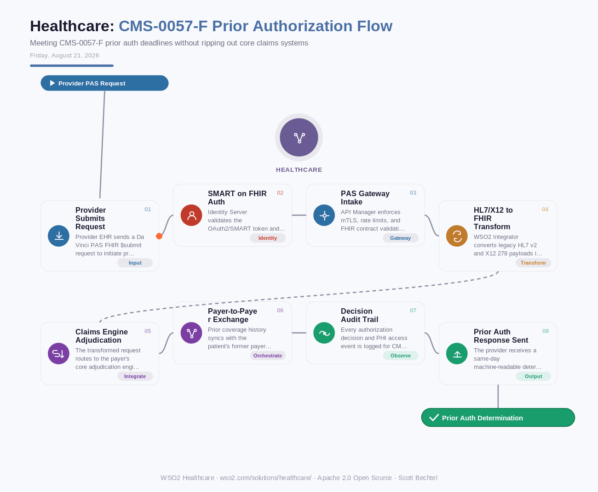

# Healthcare: CMS-0057-F Prior Authorization Flow
**Date:** Friday, August 21, 2026  **Product:** [Healthcare](https://wso2.com/solutions/healthcare/)

## Business Problem
Under CMS-0057-F, payers must expose FHIR-based Prior Authorization APIs (Da Vinci PAS) and support real-time payer-to-payer data exchange, yet many health plans still route prior auth requests through manual fax and portal workflows spread across legacy claims systems, EHRs, and multiple TPA relationships. Missing the compliance deadline risks CMS penalties and forces providers into costly delays that hurt patient care and drive up denial appeals.

## How WSO2 Solves This
WSO2 API Manager exposes Da Vinci PAS-conformant FHIR endpoints in front of legacy adjudication engines, applying centralized policy enforcement so prior authorization requests, decisions, and payer-to-payer transfers all speak a consistent, auditable FHIR contract. WSO2 Integrator (Ballerina) translates natively between HL7 v2/X12 278 legacy formats and FHIR resources, cutting the effort typically spent hand-coding these mappings. WSO2 Identity Server layers OAuth2/SMART on FHIR scopes and consent management on top, so only authorized providers, payers, and patient-facing apps can pull PHI-bearing prior auth data. Together, they let a health plan meet the CMS-0057-F deadline without ripping out core claims systems.

## Patterns Used
- Da Vinci PAS FHIR Profile
- API Gateway Pattern
- Legacy-to-FHIR Adapter Transformation
- SMART on FHIR / OAuth2 Consent Scopes

## Architecture

---
WSO2 Healthcare · wso2.com/solutions/healthcare/ ·  by, Scott Bechtel
