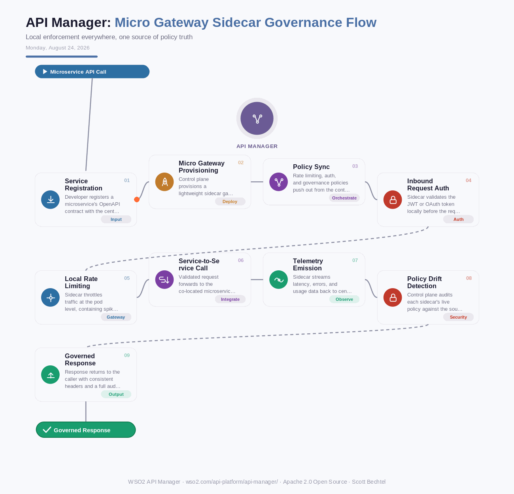

# API Manager: Micro Gateway Sidecar Governance Flow
**Date:** Monday, August 24, 2026  **Product:** [API Manager](https://wso2.com/api-platform/api-manager/)

## Business Problem
Microservice teams either route every call through one central gateway, which turns into a bottleneck and a single point of failure, or skip governance between services entirely and end up with shadow APIs and inconsistent auth. A traffic spike or breach in one service can then take down or expose the rest. Teams need per-service policy enforcement that doesn't slow down local calls or fracture governance.

## How WSO2 Solves This
WSO2 API Manager deploys lightweight Kubernetes-native micro gateways as sidecars next to each microservice, while still governing every one of them from a single control plane. Rate limiting, JWT validation, and audit logging happen locally at wire speed, so one service's problem stays contained. Central policy remains the source of truth, pushed out and synced to every sidecar automatically. You get centralized governance without the centralized bottleneck.

## Patterns Used
- Sidecar Pattern
- Decentralized Policy Enforcement
- Bulkhead Pattern
- Policy-as-Code Governance

## Architecture

---
WSO2 API Manager · wso2.com/api-platform/api-manager/ ·  by, Scott Bechtel
