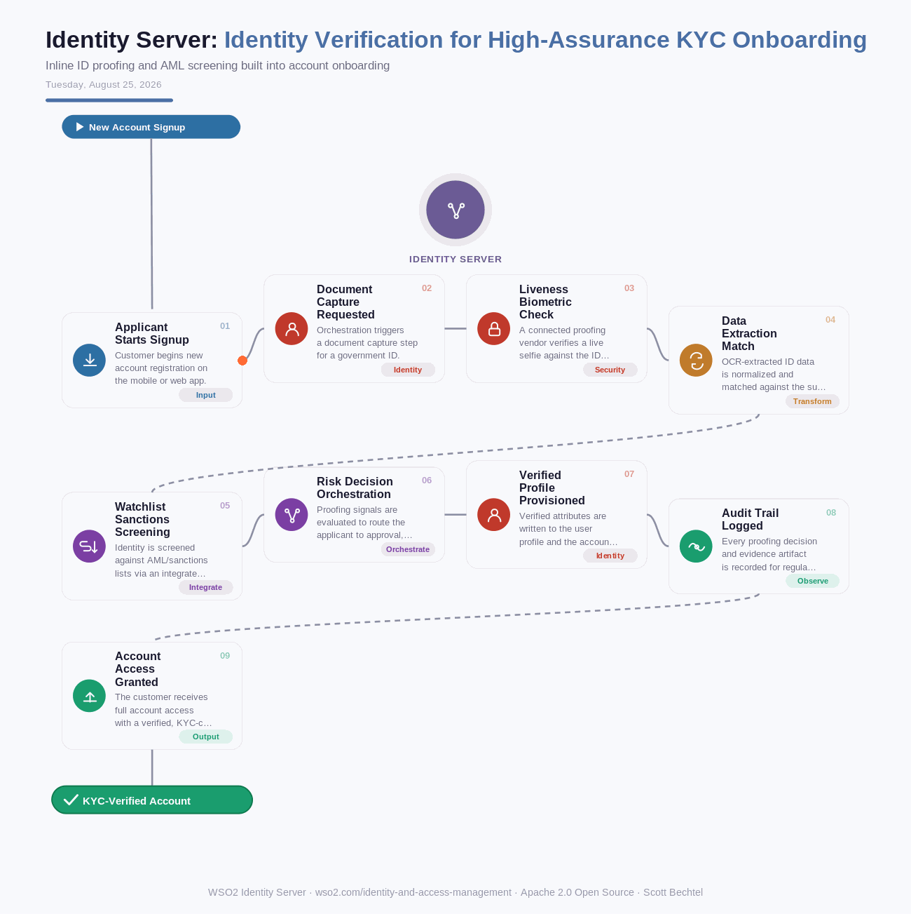

# Identity Server: Identity Verification for High-Assurance KYC Onboarding
**Date:** Tuesday, August 25, 2026  **Product:** [Identity Server](https://wso2.com/identity-and-access-management/)

## Business Problem
Regulated industries like banking, insurance, and telco must verify a new customer's real-world identity before granting account access, checking government ID authenticity, matching a live selfie, and screening against watchlists. Bolting this onto a login flow with disconnected third-party KYC vendors creates fragmented UX, slows onboarding to days, and leaves compliance teams without a clean audit trail linking the proofed identity to the resulting account.

## How WSO2 Solves This
WSO2 Identity Server's Identity Verification capability plugs external ID-proofing providers, such as document scanning, biometric liveness checks, and watchlist screening, directly into the login and registration orchestration flow, so proofing happens inline instead of as a bolt-on redirect. Verified attributes update the user's profile automatically, and every proofing decision is captured as an auditable event tied to the account for AML/KYC reporting. Because it runs on the same extensible orchestration engine as MFA and adaptive auth, proofing can be triggered conditionally, for example only on high-value accounts or step-up scenarios, so low-risk users stay on a fast path.

## Patterns Used
- KYC/AML Identity Proofing
- Risk-Based Conditional Orchestration
- Audit Event Sourcing
- Vendor-Agnostic Verification Adapter

## Architecture

---
WSO2 Identity Server · wso2.com/identity-and-access-management ·  by, Scott Bechtel
