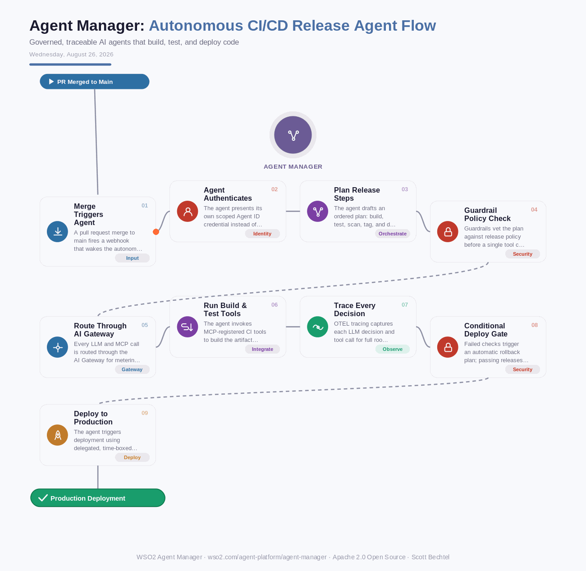

# Agent Manager: Autonomous CI/CD Release Agent Flow
**Date:** Wednesday, August 26, 2026  **Product:** [Agent Manager](https://wso2.com/agent-platform/agent-manager/)

## Business Problem
CI/CD agents that can build, test, and deploy code on their own save real engineering time, but handing an autonomous agent standing production credentials creates a serious blast-radius problem. If the agent misreads a plan, gets prompt-injected through a malicious commit message, or just makes a bad call under pressure, it can push broken or unsafe code straight to production with no one accountable for the action.

## How WSO2 Solves This
WSO2 Agent Manager gives a release agent its own scoped, revocable identity instead of a shared service account, so every build, test, and deploy action is attributable and auditable back to that one agent. Guardrails inspect the agent's release plan before it touches a pipeline, catching policy violations like skipped tests or a missing security scan before they happen. Built-in OTEL tracing captures every LLM decision and tool call, so when a deploy goes sideways, engineers can see exactly why the agent chose that path. Because it's framework-agnostic and open source, teams keep their existing CI/CD tooling and just drop the agent behind WSO2's control plane.

## Patterns Used
- Zero Standing Privilege
- Guardrail-Gated Execution
- End-to-End Trace Correlation

## Architecture

---
WSO2 Agent Manager · wso2.com/agent-platform/agent-manager · by, Scott Bechtel
