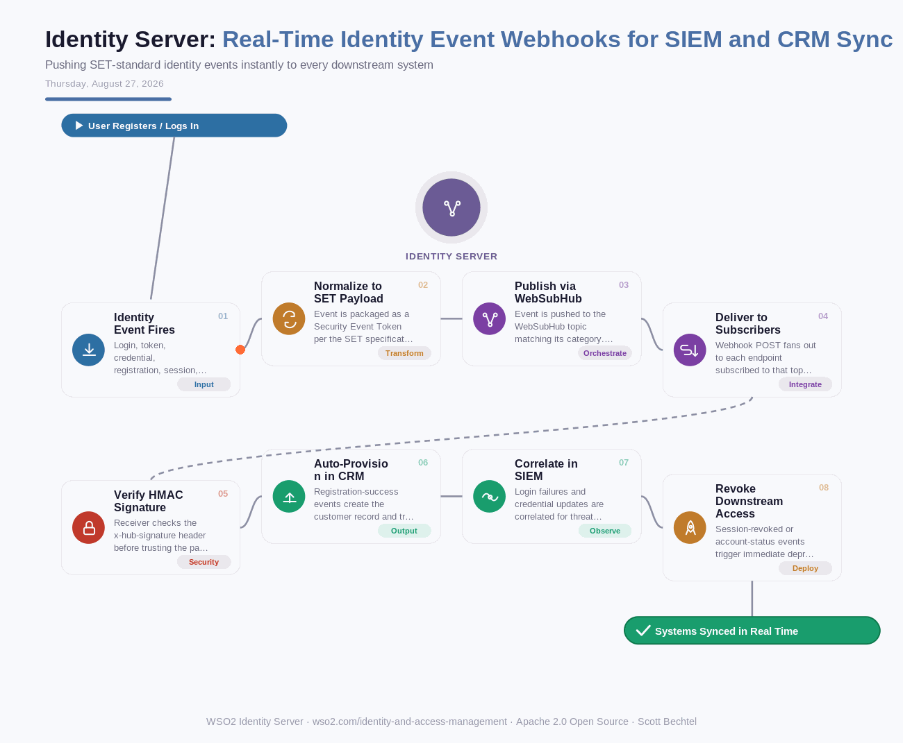

# Identity Server: Real-Time Identity Event Webhooks for SIEM and CRM Sync
**Date:** Thursday, August 27, 2026  **Product:** [Identity Server](https://wso2.com/identity-and-access-management/)

## Business Problem
When a user resets a password, fails several logins in a row, or gets deprovisioned, downstream systems like CRM, SIEM, and ITSM tools often find out hours later through a nightly batch sync. In that gap, an offboarded employee can keep a live SaaS session, and a credential-stuffing spike can go uncorrelated until the next morning's report.

## How WSO2 Solves This
WSO2 Identity Server publishes login, token, credential, registration, session, and account-management events as standardized Security Event Token (SET) payloads over the WebSubHub protocol, with every delivery HMAC-signed via the x-hub-signature header. Downstream systems subscribe once and receive events the moment they happen instead of polling or waiting on exports. A CRM can auto-provision a customer record and fire a welcome email on registration success, a SIEM can correlate login failures across regions in real time, and an ITSM tool can revoke app access the instant a session is force-terminated.

## Patterns Used
- Publish-Subscribe Pattern (WebSubHub)
- Security Event Token (SET) Standard
- HMAC Signature Verification
- Event-Driven Architecture

## Architecture

---
WSO2 Identity Server · wso2.com/identity-and-access-management ·  by, Scott Bechtel
