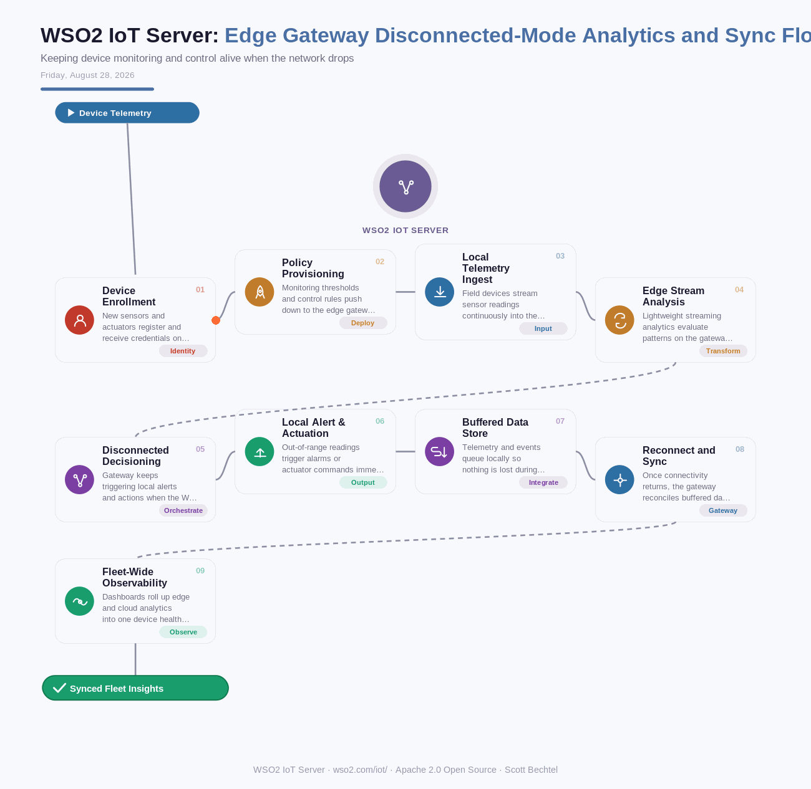

# WSO2 IoT Server: Edge Gateway Disconnected-Mode Analytics and Sync Flow
**Date:** Friday, August 28, 2026  **Product:** [WSO2 IoT Server](https://wso2.com/iot/)

## Business Problem
Manufacturing floors and remote industrial sites often lose connectivity for minutes or hours at a stretch, but safety-critical sensors and actuators can't just stop making decisions when the WAN drops. If a plant relies on a cloud IoT platform for every threshold check, an outage means blind machinery, missed alarms, and a backlog of telemetry to reconcile after reconnecting — a real risk to uptime and worker safety, not just missed data points.

## How WSO2 Solves This
WSO2 IoT Server pushes lightweight streaming analytics down to a local edge gateway, so pattern detection and alerting keep running even in disconnected mode. Devices enroll once, inherit policies, and the gateway keeps evaluating rules locally, syncing summarized results and buffered telemetry once the connection returns. Because it's open source, plant teams can adapt the gateway logic for Raspberry Pi, Arduino, or Android-based hardware without vendor lock-in. Note: WSO2 IoT Server's roadmap is now maintained by Entgra, a WSO2 technology partner — the platform still gives builders full API control over device fleets and the freedom to run analytics wherever the network allows.

## Patterns Used
- Edge Computing Pattern
- Store-and-Forward Pattern
- Policy-Based Device Management
- Local Decisioning / Disconnected Operation

## Architecture

---
WSO2 IoT Server · wso2.com/iot/ ·  by, Scott Bechtel
