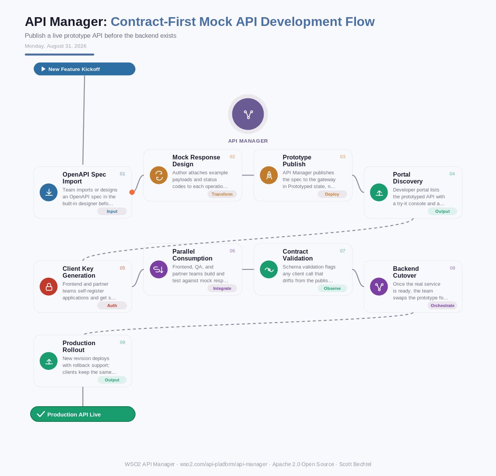

# API Manager: Contract-First Mock API Development Flow
**Date:** Monday, August 31, 2026  **Product:** [API Manager](https://wso2.com/api-platform/api-manager/)

## Business Problem
When a product team kicks off a new customer-facing feature, frontend engineers, partner integrators, and QA are often blocked for weeks waiting on a backend microservice to be built and deployed. Without a shared, running interface to develop against, teams either hand-roll local stubs that drift from the eventual contract or sit idle, pushing the launch date out and stacking up integration risk right before go-live.

## How WSO2 Solves This
WSO2 API Manager lets a team import an OpenAPI spec and publish it as a live, prototyped API in minutes, before a single line of backend code exists. Frontend, partner, and QA teams hit the same developer portal, try-it console, and auto-generated SDKs they'll use in production, just backed by mock responses instead of a real service. When the backend is finally ready, the team swaps the prototype for the production implementation through a new revision, with rollback support and without touching the contract, the SDKs, or any client code. "Waiting on the API" stops being a scheduling problem.

## Patterns Used
- Contract-First Design
- Consumer-Driven Contracts
- Revision-Based Deployment
- Strangler Fig Cutover

## Architecture

---
WSO2 API Manager · wso2.com/api-platform/api-manager ·  by, Scott Bechtel
