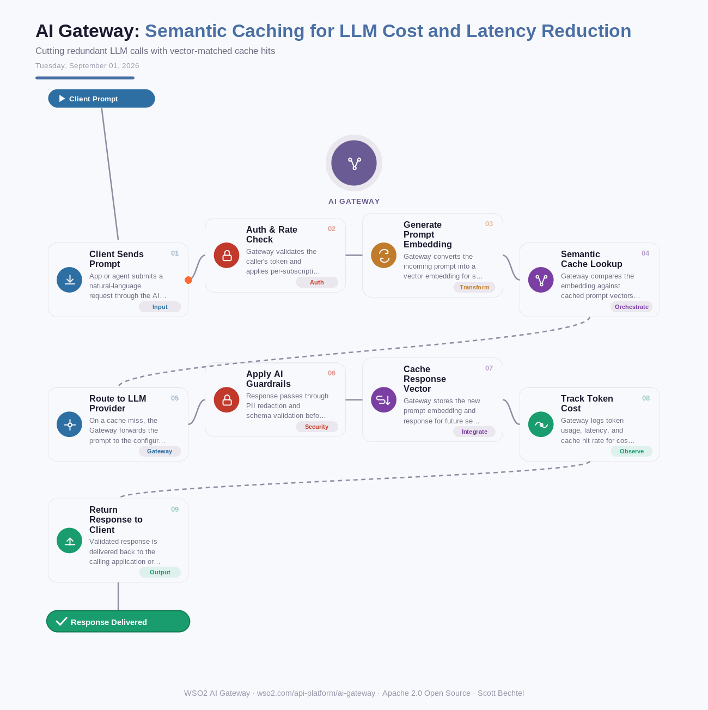

# AI Gateway: Semantic Caching for LLM Cost and Latency Reduction
**Date:** Tuesday, September 01, 2026  **Product:** [AI Gateway](https://wso2.com/api-platform/ai-gateway/)

## Business Problem

Support bots and internal copilots ask an LLM the same question a hundred different ways - "what's our return policy," "can I return this item," "return window on orders." Each phrasing triggers a full model call even though the answer never changes. Teams pay full token price and full latency for questions they already answered an hour ago.

## How WSO2 Solves This

WSO2 AI Gateway sits in front of every outbound LLM call and matches prompts by meaning, not exact text, so a paraphrased question still lands a cache hit. Close matches skip the model entirely and return the stored response in milliseconds - no token spend, no round trip to the provider. Similarity thresholds, TTLs, and invalidation rules are configurable per API, so caching stays conservative where freshness matters and aggressive for high-repeat traffic like FAQs and support triage. Usage dashboards show the hit rate and the dollars saved next to every model you're routing to.

## Patterns Used

- Semantic Caching
- Policy Enforcement Point (PEP)
- Vector Similarity Matching

## Architecture

---
WSO2 AI Gateway · wso2.com/api-platform/ai-gateway ·  by, Scott Bechtel
