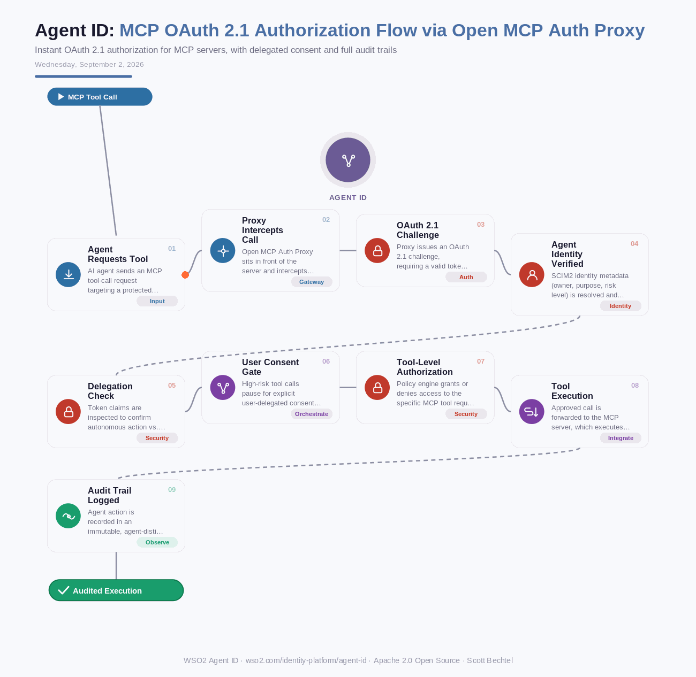

# Agent ID: MCP OAuth 2.1 Authorization Flow via Open MCP Auth Proxy
**Date:** Wednesday, September 2, 2026  **Product:** [Agent ID](https://wso2.com/identity-platform/agent-id/)

## Business Problem

Most MCP servers ship with no authorization layer at all — any client that can reach the endpoint can call its tools. Teams rewriting internal MCP servers to bolt on OAuth burn weeks per server, and even then an agent acting on a user's behalf often looks identical in the logs to one acting on its own. That's a compliance problem the first time an auditor asks who approved a transaction an agent initiated.

## How WSO2 Solves This

Agent ID's Open MCP Auth Proxy drops in front of an existing MCP server and enforces OAuth 2.1 the same day, no code changes required. It checks tool-level permissions before a call ever reaches your server, and for anything flagged high-risk, it pauses and asks the actual human for consent. Because every agent gets a SCIM2-provisioned identity with its own owner, purpose, and risk level, the resulting audit trail tells you exactly which agent did what, on whose authority.

## Patterns Used

- OAuth 2.1 Authorization Code Flow
- Delegated Authorization
- Reverse Proxy Pattern
- Zero Trust Security

## Architecture

---
WSO2 Agent ID · wso2.com/identity-platform/agent-id ·  by, Scott Bechtel
