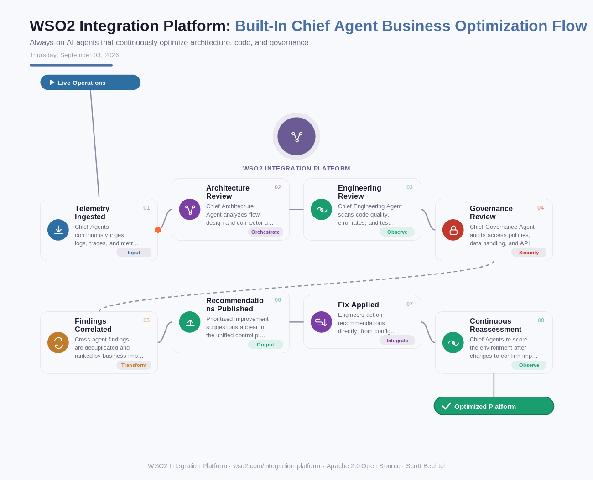

# WSO2 Integration Platform: Built-In Chief Agent Business Optimization Flow
**Date:** Thursday, September 03, 2026  **Product:** [WSO2 Integration Platform](https://wso2.com/integration-platform/)

## Business Problem
Enterprises running dozens of integration flows, APIs, and agents accumulate operational blind spots — inefficient flows, security gaps, ballooning cloud costs — that no single team has bandwidth to continuously audit. Traditional integration platforms leave this analysis to periodic manual reviews, so problems compound for months before anyone notices. By the time a security risk or cost overrun surfaces, it has already cost real money or exposed real risk.

## How WSO2 Solves This
WSO2 Integrator ships with built-in Chief Agents — Chief Architecture Agent, Chief Engineering Agent, and Chief Governance Agent — that continuously analyze live operations across your integration landscape. They review flow design, code quality, and security posture in the background, then surface prioritized, actionable recommendations directly in the console. Because they run natively inside the platform, they see everything: connectors, event streams, deployed APIs, and agent workflows, so nothing extra needs to be wired up. Instead of scheduling a quarterly platform review, the Chief Agents are always watching.

## Patterns Used
- Continuous Observability Pattern
- Multi-Agent Specialization (Separation of Concerns)
- Control Plane Aggregation
- Closed-Loop Feedback / Self-Healing Optimization

## Architecture

WSO2 Integration Platform · wso2.com/integration-platform ·  by, Scott Bechtel
