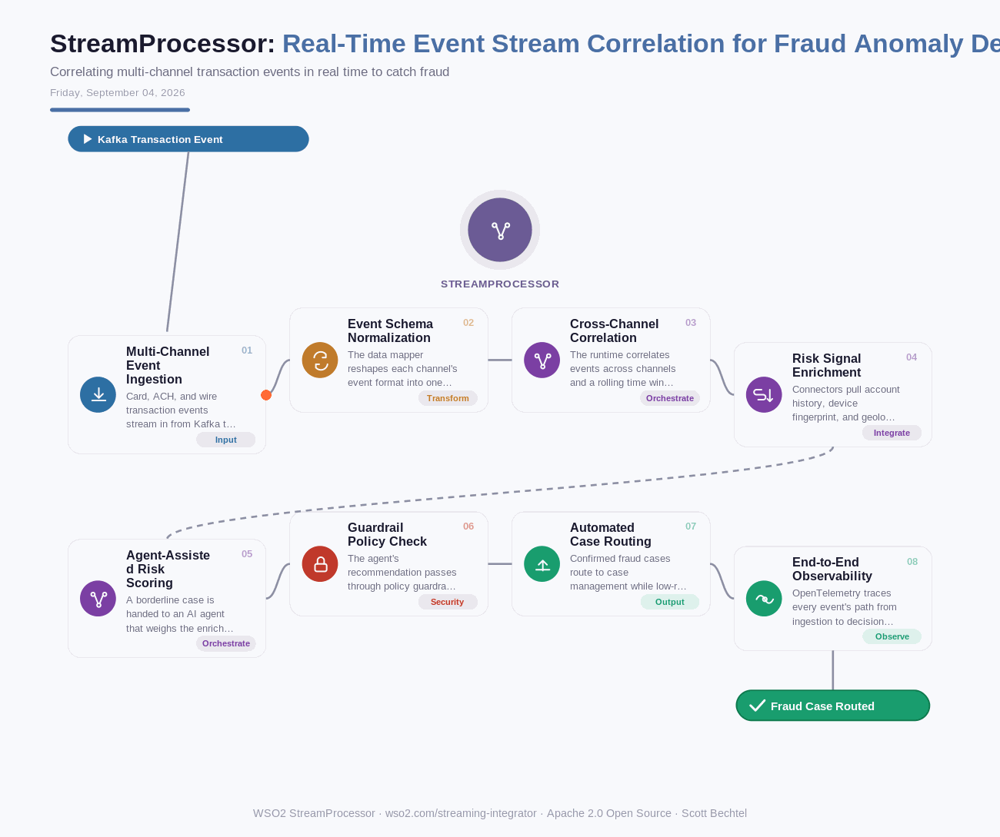

# StreamProcessor: Real-Time Event Stream Correlation for Fraud Anomaly Detection
**Date:** Friday, September 04, 2026  **Product:** [StreamProcessor](https://wso2.com/streaming-integrator/)

## Business Problem

A payments team watches transaction events land from three different channels - card, ACH, wire - and none of them talk to each other in real time. A fraud ring splits one attack across all three, and each channel looks clean on its own. By the time the nightly batch job connects the dots, the money's gone.

## How WSO2 Solves This

WSO2 Integrator pulls events straight off Kafka, AMQP, MQTT, and JMS the moment they land, so correlation starts immediately instead of waiting on a batch window. Its data mapper reshapes every channel's event into one common schema, and 600+ connectors pull in the account history, device fingerprint, and location data needed to score risk without ever leaving the flow. When a case sits in the gray zone, the same runtime hands it to an AI agent for a judgment call, then routes that recommendation through policy guardrails before anything gets blocked or cleared. One control plane, one trace, no five-console scramble when the fraud team needs answers.

## Patterns Used

- Event-Driven Architecture (Kafka/AMQP/MQTT/JMS ingestion)
- Complex Event Correlation Across Channels
- Agent-in-the-Loop Risk Scoring
- Zero Trust Guardrail Enforcement

## Architecture

---
WSO2 StreamProcessor · wso2.com/streaming-integrator ·  by, Scott Bechtel
