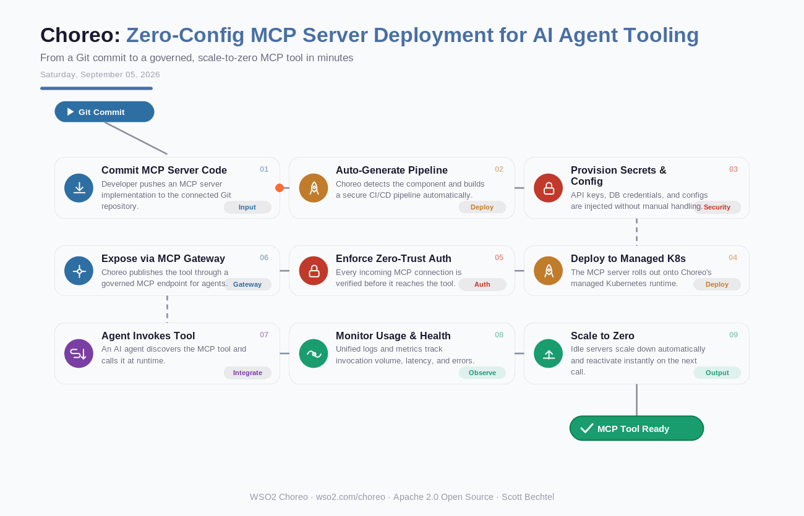

# Choreo: Zero-Config MCP Server Deployment for AI Agent Tooling
**Date:** Saturday, September 05, 2026  **Product:** [Choreo](https://wso2.com/choreo/)

## Business Problem
Teams building AI agents need MCP tools live fast, but standing up an MCP server the old way means provisioning Kubernetes, wiring secrets, auth, and observability by hand — often a week of platform work before an agent can even see the tool. That lag stalls agent projects that are supposed to move in days, not sprints.

## How WSO2 Solves This
WSO2's Choreo turns that week into minutes. Push your MCP server code to Git and Choreo auto-generates the pipeline, injects secrets, deploys to managed Kubernetes, and puts a zero-trust gateway in front of it — no YAML spelunking required. Idle servers scale to zero and spin back up the instant an agent calls them, so you're not paying for tools that sit quiet between requests. It's the difference between agent teams waiting on platform tickets and agent teams shipping.

## Patterns Used
- GitOps Deployment
- Zero-Trust Security
- Scale-to-Zero Autoscaling
- MCP Tool Registration & Governance

## Architecture

---
WSO2 Choreo · wso2.com/choreo ·  by, Scott Bechtel
