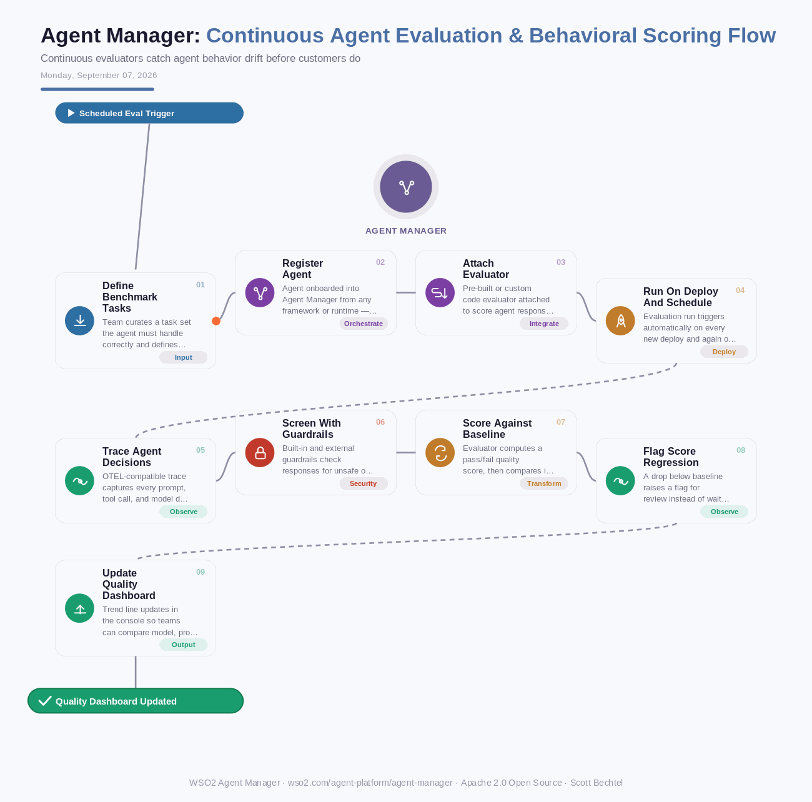

# Agent Manager: Continuous Agent Evaluation & Behavioral Scoring Flow
**Date:** Monday, September 07, 2026  **Product:** [Agent Manager](https://wso2.com/agent-platform/agent-manager/)

## Business Problem
An agent passes every manual test in staging, then a prompt tweak, a model upgrade, or a tool change quietly degrades its answers in production. Nobody notices the drop in quality until a customer complains or a support ticket lands. Without a running scorecard against a known set of tasks, behavioral regressions in an agent have no early warning system.

## How WSO2 Solves This
WSO2 Agent Manager runs pre-built and custom code evaluators continuously against every registered agent, scoring responses against a benchmark task set on each deploy and again on a recurring schedule once the agent is live. Because evaluation is wired into the control plane rather than bolted on as a separate test harness, the same scorecards travel with the agent regardless of which framework or runtime it runs on — LangChain, CrewAI, Bedrock, or otherwise. When a score drops below baseline, it shows up as a flag in the console, not as an angry email. Teams end up with one trend line for agent quality instead of scattered spreadsheets and one-off QA passes.

## Patterns Used
- Continuous Evaluation Pipeline
- Golden Task Set Benchmarking
- Baseline Regression Detection
- OTEL Distributed Tracing

## Architecture

---
WSO2 Agent Manager · wso2.com/agent-platform/agent-manager ·  by, Scott Bechtel
