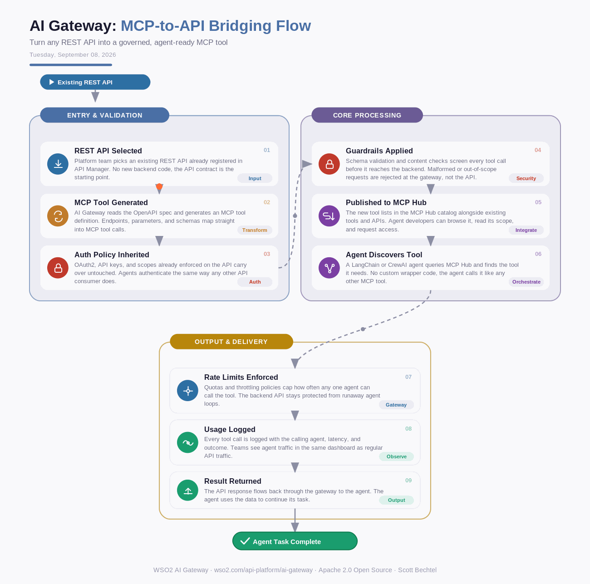

# AI Gateway: MCP-to-API Bridging Flow
**Date:** Tuesday, September 08, 2026  **Product:** [AI Gateway](https://wso2.com/api-platform/ai-gateway/)

## Business Problem
Enterprise teams building agent workflows need to expose existing REST APIs as MCP tools, but hand-writing a wrapper for every API and every agent framework does not scale. Each wrapper skips the auth, rate limiting, and audit logging already enforced on the API itself, so agents get a backdoor with none of the governance. Security teams end up finding out about agent-accessible endpoints after the fact, not before.

## How WSO2 Solves This
WSO2 AI Gateway converts an existing REST API into an MCP-compatible tool without writing wrapper code. The same policies already applied to that API, like OAuth, rate limits, and schema validation, carry over automatically, so agents get access through the same governance model as any other API consumer. Once exposed, the tool is published to the MCP Hub catalog where agent developers can find it, check its scope, and call it directly. Nothing about how you already secure the API changes, agents just become one more governed consumer of it.

## Patterns Used
- MCP-to-REST Bridging
- Policy Enforcement Point (PEP)
- API Facade Pattern
- Service Catalog / Discovery

## Architecture

WSO2 AI Gateway · wso2.com/api-platform/ai-gateway ·  by, Scott Bechtel
